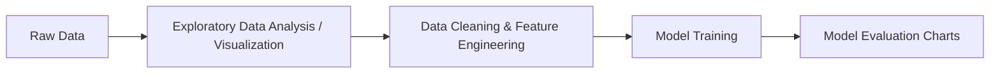

### 1. Introduction & A Brief History

Data visualization turns raw numbers into visual patterns. In Machine Learning (ML), algorithms can't tell you if your data is messy, skewed, or contains impossible values—they just process whatever numbers you feed them. Visualizing data allows you to **inspect distributions, spot outliers, check relationships between features, and evaluate model performance**.



#### How It Started: The Evolution of Python Visualization
* **2003 — Matplotlib is Born:** John D. Hunter, a neurobiologist, was analyzing electroencephalography (EEG) data. At the time, MATLAB was the dominant scientific tool, but it required proprietary licenses. Hunter created **Matplotlib** in Python to reproduce MATLAB-like plotting capabilities in an open-source ecosystem.
* **The Limitations:** Matplotlib was powerful, but its syntax was verbose, its default aesthetics looked dated, and it wasn't natively designed for tabular `pandas` DataFrames.
* **2014 — Seaborn Emerges:** Michael Waskom released **Seaborn**, built directly on top of Matplotlib. Seaborn introduced modern color palettes, integrated seamlessly with pandas, and automated complex statistical graphics (like regression lines, distributions, and confidence intervals) in just one line of code.

---

### 2. Matplotlib vs. Seaborn: How They Work Together

Think of **Matplotlib** as the raw canvas and paintbrush, and **Seaborn** as the professional graphic designer:

| Feature | Matplotlib | Seaborn |
| :--- | :--- | :--- |
| **Philosophy** | Low-level control; you can customize every pixel, spine, and tick. | High-level; designed specifically for statistical exploration. |
| **Code Length** | Often requires 5–10 lines for complex styling. | Accomplishes complex multi-variable plots in 1–2 lines. |
| **Role in ML** | Fine-tuning final figures, subplots, custom model diagnostics. | Fast Exploratory Data Analysis (EDA) and correlation mapping. |

They are **not competitors**—Seaborn actually uses Matplotlib behind the scenes.

---

### 3. Essential Charts in Machine Learning: How to Create & Interpret Them

Here are the 5 most critical charts used in every ML project, complete with runnable code and instructions on how to read them.

---

#### 1. Histogram & KDE (Checking Distributions)

* **Why ML needs it:** Most linear models (Linear Regression, Logistic Regression, Neural Networks) perform best when numerical features follow a bell-shaped (normal) distribution.
* **How to interpret:**
  * **Symmetric bell curve:** Ideal for standard models.
  * **Long tail to one side (Skewed):** You may need a log transformation before training.
  * **Two distinct peaks (Bimodal):** Your data likely contains two separate sub-groups that may need separate handling.

```python
import matplotlib.pyplot as plt
import numpy as np
import seaborn as sns

# Generate sample data: 1000 simulated customer ages
np.random.seed(42)
ages = np.random.normal(loc=35, scale=10, size=1000)

plt.figure(figsize=(8, 4))
# Seaborn histplot with Kernel Density Estimate (KDE) line
sns.histplot(ages, kde=True, color="teal", bins=30)

plt.title("Feature Distribution: Customer Age", fontsize=14)
plt.xlabel("Age")
plt.ylabel("Count")
plt.grid(axis="y", linestyle="--", alpha=0.7)
plt.show()
```

---

#### 2. Box Plot (Detecting Outliers)

* **Why ML needs it:** Outliers can severely distort models like Linear Regression and K-Means clustering.
* **How to interpret:**
  * **Center line:** The median (50th percentile).
  * **Box boundaries:** The 25th and 75th percentiles (Interquartile Range, or IQR).
  * **Whiskers:** Expected range of normal variation.
  * **Points outside whiskers:** Outliers. You must decide whether to remove, cap, or investigate them.

```python
# Sample data: Annual salary ($k) across different departments
departments = ["Sales"] * 100 + ["Engineering"] * 100 + ["Support"] * 100
salaries = np.concatenate([
    np.random.normal(70, 15, 100),
    np.random.normal(110, 20, 100),
    np.random.normal(55, 10, 100)
])

plt.figure(figsize=(8, 4))
sns.boxplot(x=departments, y=salaries, palette="Set2")

plt.title("Salary Distribution by Department (Spotting Outliers)", fontsize=14)
plt.xlabel("Department")
plt.ylabel("Salary ($k)")
plt.show()
```

---

#### 3. Scatter Plot with Regression Trend (Feature Relationships)

* **Why ML needs it:** Identifies whether an input feature ($X$) has a linear, polynomial, or non-existent relationship with the target variable ($y$).
* **How to interpret:**
  * **Points clustering tightly along the line:** Strong predictive signal.
  * **Points scattered uniformly like a cloud:** Weak or no linear relationship.
  * **U-shaped or curved pattern:** Non-linear relationship (consider tree models or polynomial features).

```python
# Sample data: Years of experience vs. Performance score
experience = np.random.uniform(1, 15, 80)
score = 30 + 4.5 * experience + np.random.normal(0, 6, 80)

plt.figure(figsize=(8, 4))
# Seaborn regplot automatically calculates and draws the best-fit line
sns.regplot(x=experience, y=score, scatter_kws={"alpha": 0.6}, line_kws={"color": "red"})

plt.title("Experience vs. Performance Score", fontsize=14)
plt.xlabel("Years of Experience")
plt.ylabel("Performance Score")
plt.show()
```

---

#### 4. Heatmap (Correlation Matrix)

* **Why ML needs it:** Detects **multicollinearity** (when two predictor features are almost identical). Feeding duplicate information increases model complexity without adding value.
* **How to interpret:**
  * Values range from **-1.0 to +1.0**.
  * **Close to +1.0 or -1.0:** Strong correlation. If two input features have a correlation $> 0.85$, consider dropping one.
  * **Close to 0.0:** No linear relationship.

```python
import pandas as pd

# Create a small simulated dataset with 4 features
df = pd.DataFrame({
    "House_Size": np.random.rand(100) * 2000 + 500,
    "Bedrooms": np.random.randint(1, 5, 100),
    "Bathrooms": np.random.randint(1, 4, 100),
    "Price": np.random.rand(100) * 500000 + 200000
})

plt.figure(figsize=(6, 5))
correlation_matrix = df.corr()

# annot=True shows the exact numerical correlation inside each square
sns.heatmap(correlation_matrix, annot=True, cmap="coolwarm", fmt=".2f", linewidths=0.5)
plt.title("Feature Correlation Matrix", fontsize=14)
plt.show()
```

---

#### 5. Confusion Matrix (Evaluating Model Performance)

* **Why ML needs it:** Accuracy alone is misleading (e.g., in fraud detection where 99% of transactions are legitimate). A confusion matrix shows *where* the model gets confused.
* **How to interpret:**
  * **Top-Left (True Negative):** Correctly predicted negative.
  * **Bottom-Right (True Positive):** Correctly predicted positive.
  * **Top-Right (False Positive):** False alarm (Type I error).
  * **Bottom-Left (False Negative):** Missed detection (Type II error—often the most dangerous in medicine or fraud).

```python
# Simulated predictions vs actual labels (e.g., 0 = Legitimate, 1 = Fraud)
# Confusion matrix structure: [[TN, FP], [FN, TP]]
cm_data = np.array([[850, 40],
                    [ 15, 95]])

plt.figure(figsize=(5, 4))
sns.heatmap(cm_data, annot=True, fmt="d", cmap="Blues",
            xticklabels=["Pred: Safe", "Pred: Fraud"],
            yticklabels=["Actual: Safe", "Actual: Fraud"])

plt.title("Model Evaluation: Confusion Matrix", fontsize=14)
plt.ylabel("True Class")
plt.xlabel("Predicted Class")
plt.show()
```

---

### 4. Summary Checklist for Any ML Project

When starting an ML task, follow this visual progression:

1. **Univariate Analysis (One variable at a time):**
   * Use **Histograms / KDE** to inspect the target and feature shapes.
   * Use **Box Plots** to spot extreme outliers.
2. **Bivariate Analysis (Two variables at a time):**
   * Use **Scatter Plots** to see how features relate to the target.
   * Use a **Heatmap** to catch redundant, highly correlated inputs.
3. **Model Evaluation:**
   * Use **Confusion Matrices**, **ROC Curves**, or **Residual Plots** to understand model errors visually before shipping to production.


   ### The Big Picture: Why Do We Visualize Data in Machine Learning?

When you work with Machine Learning, your data is stored in spreadsheets with thousands of rows and numbers. If you only look at numbers:
* You cannot tell if your data has errors or weird outliers.
* You cannot tell if two columns are telling you the exact same thing.
* You cannot see if your machine learning model is learning or just guessing.

Data visualization is **translating numbers into geometric shapes and colors** so our brains can instantly spot patterns.

---

### Quick Reference: Types of Visualization

| Chart Family | Everyday Analogy | What Question Does It Answer? | Best Python Tool |
| :--- | :--- | :--- | :--- |
| **1. Distribution** | Looking at a crowd's heights | *"How are values spread out? Are most people average, or are there extremes?"* | Seaborn (`histplot`) |
| **2. Categorical** | Sorting laundry into baskets | *"How does a number compare across different groups (e.g., Male vs. Female, Basic vs. Pro)?"* | Seaborn (`boxplot`) |
| **3. Matrix** | A city distance chart | *"How are all columns connected to all other columns at once?"* | Seaborn (`clustermap`) |
| **4. Regression** | A trajectory line showing where a ball will land | *"If feature X goes up, does target Y predictably go up or down?"* | Seaborn (`regplot`) |
| **5. Heatmap** | A thermal camera showing hot and cold spots | *"Where is the strongest connection or the biggest error in my grid?"* | Seaborn (`heatmap`) |

---

### Deep Dive: The 5 Essential Plot Types

---

### 1. Distribution Plot (Histogram + Density Curve)

#### A. Plain-English Concept
Imagine you teach a class of 100 students and you just finished grading a test (scores from 0 to 100).
* Did everyone get around a 75?
* Did half the class get 90 and the other half get 40?
* Did one person get 0 because they didn't show up?

A **distribution plot** groups numbers into buckets (bins) and shows a bar for how many people fall into each bucket. The smooth curve over the top (called the **KDE**, or Kernel Density Estimate) gives you the general "shape" of the scores.

#### B. Concrete Real-World Example
In banking, you want to inspect **credit card transaction amounts**. 
* Most transactions are small: $5 for coffee, $30 for groceries.
* Very few transactions are $5,000 for a laptop.
* A distribution plot will show a tall mountain on the left ($5–$50) and a long, flat tail stretching far to the right. This tells a machine learning engineer: *"This data is heavily skewed, so I need to transform it before feeding it to my model."*

#### C. When to Choose It
* Choose this when you want to examine **just one numeric column** by itself to see its spread, center, and unusual values.
* Do not choose this if you want to compare two different categories together.

#### D. Code Example

```python
import matplotlib.pyplot as plt
import numpy as np
import seaborn as sns

# Step 1: Create sample data (1,000 grocery store purchase amounts in dollars)
np.random.seed(42)
# Most purchases are around $30, but some go up to $100+
purchase_amounts = np.random.gamma(shape=3, scale=10, size=1000)

# Step 2: Create the canvas
plt.figure(figsize=(8, 4))

# Step 3: Draw the histogram with a smooth density curve
sns.histplot(purchase_amounts, bins=30, kde=True, color="royalblue")

# Step 4: Add clear titles and labels
plt.title("Distribution of Customer Purchase Amounts ($)", fontsize=13, weight="bold")
plt.xlabel("Amount Spent ($)")
plt.ylabel("Number of Customers")

# Step 5: Display the chart
plt.tight_layout()
plt.show()
```

---

### 2. Categorical Plot (Box Plot)

#### A. Plain-English Concept
Now imagine you want to compare test scores between **three different classes**: Morning, Afternoon, and Evening.

You can't just look at the average score because one brilliant student could pull up the whole average. A **Box Plot** solves this by slicing each group into 4 equal quarters:
* The **box** shows where the middle 50% of people sit.
* The **line inside the box** is the median (the true middle person).
* The **whiskers** (lines extending outward) show normal minimum and maximum ranges.
* The **individual dots** outside the whiskers are outliers—unusual cases you need to investigate.

#### B. Concrete Real-World Example
You are building an app to predict **house prices**. You want to know: *"Does having a swimming pool increase house price?"*
* Group 1: Houses *without* a pool.
* Group 2: Houses *with* a pool.
* By placing both box plots side-by-side, you can immediately see if the entire "box" for pool houses is shifted higher up on the price axis.

#### C. When to Choose It
* Choose this when you have **one category column** (like Department, Country, or Plan Type) and **one numeric column** (like Salary, Age, or Price).
* Choose it over a simple bar chart because a bar chart hides the spread and outliers.

#### D. Code Example

```python
import matplotlib.pyplot as plt
import numpy as np
import pandas as pd
import seaborn as sns

# Step 1: Create sample data (Salaries across three job roles)
np.random.seed(42)
roles = ["Junior Dev"] * 100 + ["Mid Dev"] * 100 + ["Senior Dev"] * 100
salaries = np.concatenate([
    np.random.normal(loc=60, scale=8, size=100),   # Junior: avg 60k
    np.random.normal(loc=90, scale=12, size=100),  # Mid: avg 90k
    np.random.normal(loc=135, scale=18, size=100)  # Senior: avg 135k
])

df_salaries = pd.DataFrame({"Role": roles, "Salary_k": salaries})

# Step 2: Create the canvas
plt.figure(figsize=(8, 5))

# Step 3: Draw the box plot
sns.boxplot(data=df_salaries, x="Role", y="Salary_k", palette="Pastel1")

# Step 4: Add labels
plt.title("Salary Spread Across Job Levels ($ in Thousands)", fontsize=13, weight="bold")
plt.xlabel("Job Role")
plt.ylabel("Annual Salary ($k)")

# Step 5: Display the chart
plt.tight_layout()
plt.show()
```

---

### 3. Matrix Plot (Clustermap)

#### A. Plain-English Concept
Imagine you run a supermarket with 50 products. You want to group products that behave similarly without manually checking all 50.
A **Matrix Plot (Clustermap)** organizes your rows and columns into a grid of colored tiles. Then, it uses an algorithm to rearrange similar rows next to each other, drawing a tree-like branch (called a **dendrogram**) along the edges showing how items group together naturally.

#### B. Concrete Real-World Example
In customer segmentation (Unsupervised Machine Learning):
* You have 10 customer features: *App Usage, Logins, Purchases, Returns, Support Calls, Discounts Used, etc.*
* A clustermap will automatically group customers with high purchases and high logins together ("Power Users") and group customers with high support calls and high returns together ("Frustrated Users").

#### C. When to Choose It
* Choose this when you want to discover **hidden clusters or natural groupings** in a table of numbers.
* Choose it over a regular heatmap when your rows and columns don't have an obvious alphabetical or chronological order, and you want Python to sort them by similarity for you.

#### D. Code Example

```python
import matplotlib.pyplot as plt
import numpy as np
import pandas as pd
import seaborn as sns

# Step 1: Create a small dataset of 6 users rated on 5 app engagement habits
np.random.seed(42)
users = [f"User_{i+1}" for i in range(6)]
habits = ["Browsing", "Purchasing", "Reviewing", "Chatting", "Returning"]

ratings = pd.DataFrame(
    np.random.randint(1, 10, size=(6, 5)),
    index=users,
    columns=habits
)

# Step 2: Draw the clustermap
# (Note: clustermap manages its own figure window size automatically)
cluster = sns.clustermap(
    ratings,
    annot=True,       # Print the number inside each square
    cmap="YlGnBu",    # Yellow-Green-Blue color theme
    linewidths=0.5,
    figsize=(6, 5)
)

cluster.fig.suptitle("User Engagement Similarity (Grouped by AI)", y=1.05, fontsize=12, weight="bold")
plt.show()
```

---

### 4. Regression Plot (Scatter Plot + Trend Line)

#### A. Plain-English Concept
A scatter plot places dots on a grid where the X-axis is one feature and the Y-axis is another.
A **Regression Plot** takes those dots and draws the single best straight line through them. It also draws a subtle shaded band around the line—this band represents the **confidence interval** (how certain the math is about that trend line).

#### B. Concrete Real-World Example
Suppose you run an ice-cream shop. You track:
* X-axis: **Outside temperature** in degrees.
* Y-axis: **Daily sales** in dollars.
* When temperature goes up, sales go up. The regression line gives you a mathematical rule: *"For every 1 degree warmer it gets, we make an extra $45."* This is the exact foundation of Linear Regression in machine learning.

#### C. When to Choose It
* Choose this when you want to see if **one number directly causes or tracks another number**.
* Choose it over a basic scatter plot when you need to prove whether the relationship is positive (sloping up), negative (sloping down), or flat (no relationship at all).

#### D. Code Example

```python
import matplotlib.pyplot as plt
import numpy as np
import pandas as pd
import seaborn as sns

# Step 1: Create sample data (Study Hours vs. Exam Score)
np.random.seed(42)
hours_studied = np.random.uniform(1, 10, size=50)
# Score increases by roughly 7 points per hour + some random variation
exam_scores = 35 + (6.5 * hours_studied) + np.random.normal(0, 5, size=50)

df_study = pd.DataFrame({"Hours": hours_studied, "Score": exam_scores})

# Step 2: Create the canvas
plt.figure(figsize=(8, 4))

# Step 3: Draw regression plot
sns.regplot(
    data=df_study,
    x="Hours",
    y="Score",
    scatter_kws={"color": "darkblue", "alpha": 0.6},
    line_kws={"color": "crimson", "linewidth": 2}
)

# Step 4: Labels
plt.title("Study Hours vs. Final Exam Score", fontsize=13, weight="bold")
plt.xlabel("Hours Spent Studying")
plt.ylabel("Exam Score (0 - 100)")
plt.grid(True, linestyle="--", alpha=0.5)

# Step 5: Display
plt.tight_layout()
plt.show()
```

---

### 5. Heatmap (Correlation Matrix)

#### A. Plain-English Concept
Correlation is a single number between **-1.0** and **+1.0**:
* **+1.0:** Perfect lockstep. (When one goes up, the other always goes up).
* **0.0:** Zero connection. (Completely random).
* **-1.0:** Perfect opposite. (When one goes up, the other always drops).

A **Heatmap** turns a whole table of these correlation numbers into colors (e.g., Red for strong positive, Blue for strong negative). Instead of reading 20 decimal numbers, your eyes just look for the bright colors.

#### B. Concrete Real-World Example
In a car dataset, you have: *Engine Size, Horsepower, Curb Weight, and Fuel Efficiency (MPG).*
* A heatmap will show a dark blue block (-0.85) between **Engine Size** and **Fuel Efficiency** (bigger engine = lower MPG).
* It will also show a bright red block (+0.90) between **Engine Size** and **Curb Weight**. This warns the machine learning engineer: *"Both columns convey almost identical information; maybe drop one to prevent redundancy."*

#### C. When to Choose It
* Choose this during **Feature Selection** before training any machine learning algorithm.
* Choose it over scatter plots when you have 4 to 15 different numerical columns and you need to compare all of them at once.

#### D. Code Example

```python
import matplotlib.pyplot as plt
import numpy as np
import pandas as pd
import seaborn as sns

# Step 1: Create sample vehicle metrics
np.random.seed(42)
engine_size = np.random.uniform(1.5, 5.0, 100)
horsepower = engine_size * 55 + np.random.normal(0, 15, 100)
weight = engine_size * 800 + np.random.normal(0, 100, 100)
mpg = 50 - (engine_size * 6.5) + np.random.normal(0, 2, 100)

df_cars = pd.DataFrame({
    "Engine_Size": engine_size,
    "Horsepower": horsepower,
    "Weight_lbs": weight,
    "MPG": mpg
})

# Step 2: Calculate the correlation numbers
correlation_table = df_cars.corr()

# Step 3: Draw the heatmap
plt.figure(figsize=(7, 5))
sns.heatmap(
    correlation_table,
    annot=True,         # Show the decimal number in the box
    fmt=".2f",          # Round to 2 decimal places
    cmap="coolwarm",    # Cool (blue) = negative, Warm (red) = positive
    vmin=-1, vmax=1,    # Scale bounds
    linewidths=0.5
)

plt.title("Vehicle Attributes Correlation Matrix", fontsize=13, weight="bold")
plt.tight_layout()
plt.show()
```

---

### Capstone Project: Real-World Machine Learning Diagnostic

#### The Business Problem
A streaming service (like Netflix or Spotify) is losing subscribers (**Customer Churn**). Management wants to know:
1. *Are subscribers who pay higher monthly fees leaving faster?*
2. *Does frequent app usage protect customers from canceling?*
3. *Which customer behaviors have the strongest link to cancellations?*

We will build a **3-panel diagnostic dashboard** combining:
1. **Heatmap** (to scan all relationships).
2. **Box Plot** (to compare monthly fees between retained vs. churned customers).
3. **Regression Plot** (to check if watch hours decrease as tenure increases for churning users).

```python
import matplotlib.pyplot as plt
import numpy as np
import pandas as pd
import seaborn as sns

# -------------------------------------------------------------
# 1. GENERATE REALISTIC DATA
# -------------------------------------------------------------
np.random.seed(42)
total_users = 400

# Features
tenure_months = np.random.uniform(1, 36, size=total_users)        # How long they have been a member
monthly_fee = np.random.normal(loc=14, scale=3, size=total_users)  # Monthly subscription fee ($)
weekly_hours = (tenure_months * 0.4) + np.random.normal(5, 2, size=total_users) # App watch time

# Churn logic: High fee + low watch time = high chance of leaving
churn_score = (monthly_fee * 0.15) - (weekly_hours * 0.2) + np.random.normal(0, 0.5, total_users)
churned = (churn_score > 0.6).astype(int)

df = pd.DataFrame({
    "Tenure_Months": tenure_months,
    "Monthly_Fee": monthly_fee,
    "Weekly_Hours": weekly_hours.clip(0.5, None),
    "Churn": churned
})
df["Status"] = df["Churn"].map({0: "Stayed", 1: "Canceled"})

# -------------------------------------------------------------
# 2. CREATE A 3-PANEL DASHBOARD
# -------------------------------------------------------------
fig, axes = plt.subplots(1, 3, figsize=(16, 5))

# PANEL 1: Heatmap (Find the strongest factors)
corr = df.drop(columns=["Status"]).corr()
sns.heatmap(corr, annot=True, fmt=".2f", cmap="vlag", vmin=-1, vmax=1, ax=axes[0])
axes[0].set_title("1. What Correlates with Churn?", weight="bold")

# PANEL 2: Box Plot (Compare fees by status)
sns.boxplot(data=df, x="Status", y="Monthly_Fee", palette=["#72b7b2", "#e15759"], ax=axes[1])
axes[1].set_title("2. Do Churned Users Pay More?", weight="bold")
axes[1].set_xlabel("Customer Decision")
axes[1].set_ylabel("Monthly Fee ($)")

# PANEL 3: Regression Plot (Look at usage trends over time)
sns.regplot(
    data=df[df["Churn"] == 0],
    x="Tenure_Months", y="Weekly_Hours",
    scatter_kws={"alpha": 0.3, "color": "teal"},
    line_kws={"color": "teal", "label": "Stayed"},
    ax=axes[2]
)
sns.regplot(
    data=df[df["Churn"] == 1],
    x="Tenure_Months", y="Weekly_Hours",
    scatter_kws={"alpha": 0.3, "color": "crimson"},
    line_kws={"color": "crimson", "label": "Canceled"},
    ax=axes[2]
)
axes[2].set_title("3. Watch Time vs. Membership Age", weight="bold")
axes[2].set_xlabel("Tenure (Months)")
axes[2].set_ylabel("Weekly Watch Hours")
axes[2].legend()

# -------------------------------------------------------------
# 3. PRESENT DASHBOARD
# -------------------------------------------------------------
plt.suptitle("Subscription Churn Diagnostic Dashboard", fontsize=14, weight="bold", y=1.03)
plt.tight_layout()
plt.show()
```

#### How to Interpret This Dashboard:
1. **Heatmap (Panel 1):** Looking down the `Churn` column, `Monthly_Fee` has a positive number (higher price correlates with leaving), while `Weekly_Hours` has a negative number (more watching correlates with staying).
2. **Box Plot (Panel 2):** The red box ("Canceled") sits noticeably higher than the green box ("Stayed"). This proves that pricing is a direct point of friction.
3. **Regression Plot (Panel 3):** The red trend line stays flat and low across all months, showing that subscribers who eventually churn were disengaged right from the start.