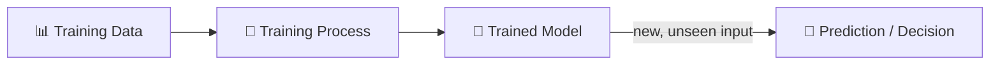
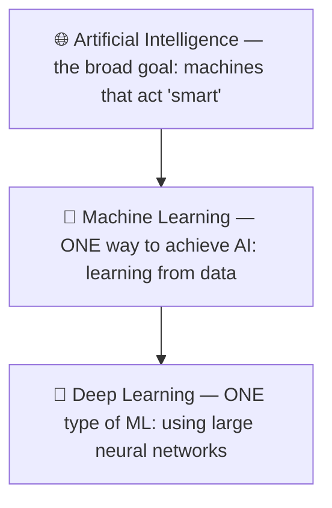
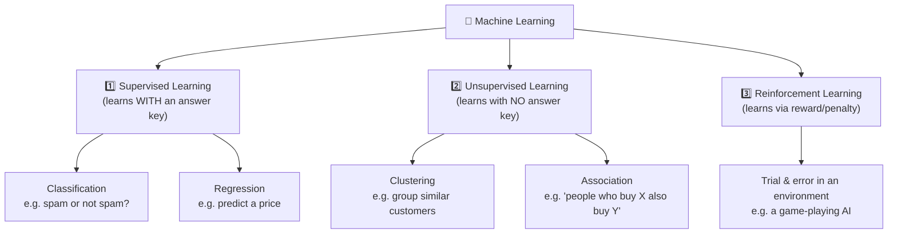
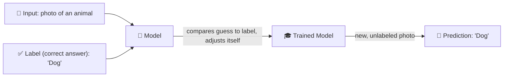
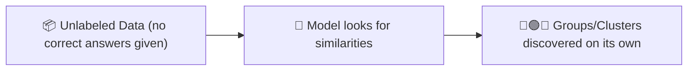
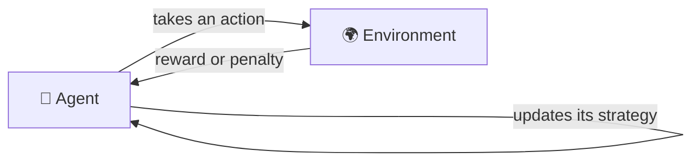
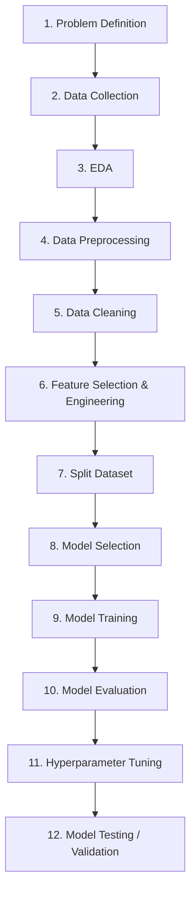

# Machine Learning — Introduction

## 📑 Table of Contents

**1. Foundations**
- [🎯 Learning Goal](#learning-goal)
- [🤔 What is it?](#what-is-it)
- [❓ Why do we need it?](#why-do-we-need-it)
- [🧠 Key Idea](#key-idea)
- [📚 Important Terms](#important-terms)
- [🔄 How it Works](#how-it-works)
- [🌍 Real-Life Example](#real-life-example)

**2. Seeing it in Action**
- [💻 Technical Example — Netflix Recommendations](#technical-example)
- [🖼 Visual Representation](#visual-representation)

**3. Traditional Programming vs Machine Learning**
- [⚖ Comparison](#traditional-vs-ml)

**4. AI vs ML vs DL**
- [⚖ Comparison](#ai-vs-ml-vs-dl)

**5. Types of Machine Learning**
- [🧩 Overview](#types-of-ml)
- [1️⃣ Supervised Learning](#supervised-learning)
- [2️⃣ Unsupervised Learning](#unsupervised-learning)
- [3️⃣ Reinforcement Learning](#reinforcement-learning)
- [⚖ Comparing the 3 Types](#types-comparison)

**6. Exploratory Data Analysis (EDA)**
- [🔎 EDA and Types of EDA](#eda)
- [📌 Why EDA Really Matters](#eda-importance)

**7. Building an ML Model — The Workflow**
- [🛠 Steps to Build a Machine Learning Model](#ml-workflow)
- [🧽 Data Preprocessing](#data-preprocessing)
- [🧹 Data Cleaning (Missing Values & Duplicates)](#missing-values-cleaning)

**8. Wrap-Up**
- [💡 Easy Trick to Remember](#easy-trick)
- [⚠ Common Misconceptions](#misconceptions)
- [🔍 Interview Questions](#interview-questions)
- [📝 Quick Revision](#quick-revision)
- [🎓 Cheat Sheet](#cheat-sheet)
- [📖 Related Topics](#related-topics)
- [🎯 Key Takeaways](#key-takeaways)

> 💡 Click any link above to jump straight to that section.

---

<a id="learning-goal"></a>
## 🎯 Learning Goal

By the end of this note, I will understand what Machine Learning actually is, how it's fundamentally different from traditional programming, where it quietly shows up in apps I use every day (Netflix, Google Translate), how AI, ML, and Deep Learning relate to each other — not three separate things, but three nested circles — and the 3 major types of Machine Learning (Supervised, Unsupervised, Reinforcement) and how they differ.

---

<a id="what-is-it"></a>
## 🤔 What is it?

**Machine Learning (ML)** is a way of teaching computers to learn from data — the same way we humans learn from experience — instead of being told every single rule by hand.

> 🧸 Think of a child learning to recognize a dog. Nobody hands the child a rulebook ("if it has 4 legs AND fur AND barks, it's a dog"). Instead, the child sees hundreds of dogs — big ones, small ones, different colors — and slowly learns to recognize "dog-ness" from examples. Machine Learning works the same way: show the computer LOTS of examples, and it figures out the pattern on its own.

---

<a id="why-do-we-need-it"></a>
## ❓ Why do we need it?

- Some problems are too complex to write exact rules for. Nobody can write a rulebook for "what will this specific person enjoy watching next" — but a model can learn it from millions of viewing patterns.
- Rules written by hand break the moment reality shifts slightly (new slang, a new accent, a new spam trick). A model that LEARNS from data can be retrained as data changes, instead of a human rewriting rules forever.
- It lets computers handle tasks that are natural for humans but nearly impossible to describe as fixed steps — recognizing a face, understanding a sentence, translating a language.

---

<a id="key-idea"></a>
## 🧠 Key Idea

- ML flips the usual programming relationship: instead of writing the RULES yourself, you feed the computer DATA + ANSWERS, and it works out the rules on its own.
- The result of "learning" is called a **model** — a trained mathematical structure that has captured the pattern in the data.
- More/better data generally means a better model — this is why data is often called the "fuel" of Machine Learning.
- ML, AI, and Deep Learning are NOT three competing technologies — they're nested inside one another (AI is the big goal, ML is one way to achieve it, Deep Learning is one type of ML).
- A trained model doesn't "understand" anything the way a person does — it recognizes statistical patterns in the data it was trained on.

---

<a id="important-terms"></a>
## 📚 Important Terms

| Term | Simple Meaning | Example |
|------|----------------|----------|
| Artificial Intelligence (AI) | The broad goal of making machines act "smart" | A chess-playing computer, a chatbot, a self-driving car |
| Machine Learning (ML) | Teaching a computer to learn patterns from DATA, instead of hardcoded rules | Netflix recommendations, spam filters |
| Deep Learning (DL) | A type of ML using large, brain-inspired networks (neural networks) with many layers | Face recognition, ChatGPT-style language models |
| Model | The trained "thing" that has learned the pattern and can make predictions | A trained Netflix recommender |
| Training | The process of showing a model lots of data so it learns the pattern | Feeding millions of watch-histories into an algorithm |
| Training Data | The examples used to teach the model | Past movies you've watched and rated |
| Prediction | The model's output/guess for new, unseen data | "You might like this next" |
| Traditional Programming | Writing explicit step-by-step rules for the computer to follow | `if age >= 18: allow_entry()` |

---

<a id="how-it-works"></a>
## 🔄 How it Works



Read it like this: you gather **Data** (e.g. millions of "user watched movie X, then watched movie Y" records). The **Training Process** feeds that data through an algorithm that hunts for patterns. What comes out is a **Model** — not code you wrote line-by-line, but a learned structure. From then on, you give the model NEW input it has never seen before, and it produces a **Prediction** based on the patterns it learned.

---

<a id="real-life-example"></a>
## 🌍 Real-Life Example

**Netflix:** Netflix doesn't have a human writing rules like "if this user watched 3 comedies, recommend a 4th comedy." Instead, it trains a model on the viewing habits of MILLIONS of users — who watched what, when, for how long, what they skipped — and the model learns patterns like "people who enjoyed A and B tend to also enjoy C," even patterns too subtle for a human to ever notice or write down.

**Google Translate:** Early translation software used hand-written grammar rules for every language pair — brittle, and it broke on slang, idioms, and exceptions. Modern Google Translate is trained on millions of already-translated sentence pairs (books, websites, subtitles) and learns the PATTERNS of how meaning maps between languages — which is why it handles slang and unusual phrasing far better than the old rule-based systems ever could.

---

<a id="technical-example"></a>
## 💻 Technical Example — Netflix Recommendations

**The old (rule-based) way** someone might try to hand-code this:
```
IF user watched "Stranger Things"
AND user watched "Dark"
THEN recommend "The OA"
```
This falls apart instantly — you'd need a near-infinite number of hand-written `IF` rules to cover every possible combination of shows a user could have watched, and it would never adapt to a brand-new show.

**The ML way**, roughly speaking:
1. **Collect data:** millions of records of `(user, show watched, rating, time spent)`.
2. **Train a model:** an algorithm looks across ALL users and finds patterns — e.g. "users who rated sci-fi shows highly also tend to enjoy certain thriller shows," even ones that don't share an obvious theme.
3. **Predict:** for YOU specifically, the model looks at what you've watched, compares it to patterns learned from everyone else, and outputs a ranked list of shows you're statistically likely to enjoy.

No human ever wrote "if X then recommend Y" — the model discovered relationships between shows directly from behavior data, including relationships a human might never have thought to write a rule for.

---

<a id="visual-representation"></a>
## 🖼 Visual Representation

```
Traditional Programming              Machine Learning
------------------------             ------------------------
Rules  ──┐                           Data     ──┐
Data   ──┼──▶ Program ──▶ Answers    Answers  ──┼──▶ Training ──▶ Model
         ┘                                    ┘
```

The flip is the whole point: in traditional programming, RULES + DATA go IN and ANSWERS come out. In Machine Learning, DATA + ANSWERS (examples of correct outcomes) go IN, and what comes out is the RULES themselves — packaged as a trained **model**.

---

<a id="traditional-vs-ml"></a>
## ⚖ Traditional Programming vs Machine Learning

| | Traditional Programming | Machine Learning |
|---|---|---|
| What you provide | Explicit rules + data | Data + correct answers (examples) |
| What comes out | Answers | A model (which then produces answers for NEW data) |
| Who writes the logic | A human programmer, line by line | The algorithm, by finding patterns in data |
| Best suited for | Problems with clear, fixed rules (tax calculations, sorting a list) | Problems too complex/fuzzy to write exact rules for (recommendations, image recognition, translation) |
| What happens when the real world changes | A human must rewrite the rules | The model can be retrained on new data |
| Example | `if amount > 10000: flag_transaction()` | A model trained on millions of past transactions that learns what "suspicious" looks like |

> 🧸 Traditional programming is like giving someone a strict recipe card. Machine Learning is like letting someone taste 10,000 dishes and figure out on their own what makes a dish "good" — then trusting their learned judgment on a brand-new dish.

---

<a id="ai-vs-ml-vs-dl"></a>
## ⚖ AI vs ML vs DL

These three are NOT separate competing fields — they're **nested circles**, each one a subset of the one before it.



| | Artificial Intelligence (AI) | Machine Learning (ML) | Deep Learning (DL) |
|---|---|---|---|
| Scope | Broadest — the overall goal | A subset of AI | A subset of ML |
| Approach | Any technique that makes a machine act intelligently (including hand-written rules) | Specifically LEARNING from data, not hardcoded rules | Learning using multi-layered neural networks, inspired loosely by the brain |
| Needs huge data? | Not necessarily | Often, yes | Almost always — DL is especially data-hungry |
| Example | A rule-based chess engine, a chatbot, ML itself | Netflix recommendations, spam filters, basic price prediction | Face recognition, self-driving car vision, ChatGPT-style language models |

> 🧸 Think of it like: **AI** is "transportation" (the broad goal — getting somewhere). **ML** is "a car" (one specific WAY to achieve that goal). **DL** is "an electric car" (one specific, more advanced KIND of car). Every electric car is a car, and every car is a form of transportation — but not all transportation is a car, and not all cars are electric.

> ✅ **Quick recap, in one breath:** AI is the big picture — the overall goal. ML is the "brain" that LEARNS from data instead of being told what to do. Deep Learning is the "superpower brain" — a bigger, more powerful version of that same brain, built specifically to handle harder, more complex problems (like recognizing faces or understanding language).

---

<a id="types-of-ml"></a>
## 🧩 Types of Machine Learning

Machine Learning has **3 major types**, and most beginners mix them up. The difference boils down to one question: **"what kind of data/feedback does the model get while learning?"**

| Type | Learns From | In One Line |
|---|---|---|
| Supervised Learning | Labeled data (input + the correct answer) | Learning WITH an answer key |
| Unsupervised Learning | Unlabeled data (no correct answer given) | Finding hidden patterns with NO answer key |
| Reinforcement Learning | Trial and error, via rewards/penalties | Learning by getting treats or getting scolded |

**The full picture as a tree:**



<a id="supervised-learning"></a>
### 1️⃣ Supervised Learning — Learning WITH an Answer Key

**Supervised Learning** trains a model on **labeled data** — every example comes with the correct answer already attached. The model's whole job during training is to get better at matching its guess to that known answer.

> 🧸 Think of a student studying with flashcards that have the answer written on the back. Question side: "What's this animal?" Answer side: "Dog." After enough flashcards, the student learns to recognize a dog on sight — even a NEW dog they've never seen a flashcard for.



**Real examples:** spam detection (emails labeled `spam` / `not spam`), predicting house prices (past houses labeled with their actual sale price), Netflix predicting your star-rating for a movie based on ratings you've already given other movies.

---

<a id="unsupervised-learning"></a>
### 2️⃣ Unsupervised Learning — Finding Patterns With NO Answer Key

**Unsupervised Learning** trains a model on **unlabeled data** — no correct answers are provided at all. The model's job is to find hidden structure or groupings in the data purely by noticing similarities, entirely on its own.

In one line: **Supervised Learning finds a PREDICTION** — it already knows the right answer and learns to guess it. **Unsupervised Learning finds a PATTERN** — there's no right answer to guess, it just notices which things are similar and groups them together.

> 💡 Side note: Unsupervised Learning isn't only used on its own — sometimes it's used as a helpful FIRST step for Supervised Learning. For example, it can group or simplify messy raw data first, and that cleaned-up version is then used to train a Supervised model. So the two aren't always completely separate.

> 🧸 Think of dumping a mixed box of buttons on a table with NO instructions, and being asked to sort them into groups. Nobody tells you the categories — but you'll naturally start grouping by color, or size, or shape, because your brain notices the SIMILARITIES on its own. That's exactly what unsupervised learning does with data.



**Real examples:** Netflix/Spotify grouping users into hidden "taste clusters" nobody explicitly defined (it's never told "these are the sci-fi lovers" — it just notices which users behave similarly), grouping customers by shopping habits for targeted marketing, detecting unusual/fraudulent transactions by noticing they don't fit any normal group.

---

<a id="reinforcement-learning"></a>
### 3️⃣ Reinforcement Learning — Learning by Trial and Error

**Reinforcement Learning (RL)** has no labeled data and no pre-existing dataset to sort at all — instead, an **agent** takes actions inside an **environment**, and gets a **reward** (good move) or **penalty** (bad move) after each one. Over many, many attempts, it learns which actions lead to the best long-term reward.

In simple words: if the model does something wrong, we **punish** it (a penalty). If it does something right, we **reward** it. The model has no idea what "right" or "wrong" means at the start — it only learns by trying things over and over, and noticing which actions keep earning rewards.

> 🧸 Think of training a dog with treats. The dog doesn't get a rulebook — it tries a behavior, and either gets a treat (reward: "sit" → treat) or gets nothing (no reward: jumping on the couch → no treat). After enough repetition, the dog learns which actions consistently earn rewards, purely through trial and error.



**Real examples:** an AI learning to play Chess or Go by playing millions of games against itself (win = reward), a robot learning to walk by being "rewarded" for staying upright and "penalized" for falling, self-driving car systems learning safe driving behavior through simulated trial and error.

---

<a id="types-comparison"></a>
### ⚖ Comparing the 3 Types

| | Supervised Learning | Unsupervised Learning | Reinforcement Learning |
|---|---|---|---|
| Data used | Labeled (input + correct answer) | Unlabeled (no correct answer) | No fixed dataset — an environment to interact with |
| Feedback signal | The known correct answer, every time | None — finds structure on its own | Reward or penalty, after each action |
| Goal | Predict the correct answer for NEW input | Discover hidden groups/patterns | Learn the best sequence of actions over time |
| Real example | Spam detection, price prediction | Customer segmentation, anomaly detection | Game-playing AI, robotics, self-driving decisions |

> ❌ Misconception: all Machine Learning works the same way — feed it data, get a prediction.
> ✅ Correct: HOW a model learns is completely different across the 3 types — with an answer key (Supervised), without one (Unsupervised), or through rewards from trial and error (Reinforcement) — and picking the right type for your problem matters just as much as picking the right algorithm.

---

<a id="eda"></a>
## 🔎 EDA and Types of EDA

### 🤔 What is it?

**Exploratory Data Analysis (EDA)** is the step where you actually LOOK at your data before doing anything else with it — checking what's in it, what's missing, what looks unusual, and what patterns are already sitting there in plain sight.

> 🧸 Think of EDA like walking through a house before you buy it. You don't just sign the papers — you check every room, open the cupboards, check if the taps work, and look for cracks in the wall. EDA is that same "walkthrough," but for your data, before you trust it enough to train a model on it.

### ❓ Why do we need it?

- Real-world data is messy — missing values, wrong data types, duplicate rows, weird outliers (like an "age" of 300). EDA is how you catch these BEFORE they quietly break your model.
- It helps you understand the data's shape and relationships — which columns matter, which are useless, which two columns move together — before you pick a model or write a single line of training code.
- Skipping EDA is one of the most common beginner mistakes — you can build a technically perfect model on bad or misunderstood data and still get bad results, because it's "garbage in, garbage out."

### 🧩 Types of EDA

EDA is usually split into **3 types**, based on how many columns (variables) you're looking at together:

| Type | Looks At | Simple Example |
|------|----------|-----------------|
| **Univariate** ("one variable") | ONE column at a time | Just the "Age" column — what's the average age? What's the range? |
| **Bivariate** ("two variables") | The RELATIONSHIP between TWO columns | Does "Age" affect "Salary"? Plot one against the other. |
| **Multivariate** ("many variables") | THREE or more columns together | How do "Age," "Salary," AND "City" all relate to each other at once? |

> 🧸 Think of it like zooming a camera: Univariate is a close-up photo of ONE thing. Bivariate is a photo showing how TWO things relate. Multivariate is stepping back to see how a WHOLE GROUP of things interact together.

> 💡 You'll also hear EDA split a different way — by TOOL instead of by variable count: **Graphical EDA** uses charts and plots (histograms, scatter plots, box plots) to SEE patterns visually, while **Non-Graphical EDA** uses plain numbers and statistics (mean, median, min, max) to DESCRIBE the data. Most real EDA uses a mix of both.

EDA usually happens right after collecting your data and before cleaning it — it's how you figure out WHAT needs cleaning in the first place (see [Step 3 in the ML workflow below](#ml-workflow)).

---

<a id="ml-workflow"></a>
## 🛠 Steps to Build a Machine Learning Model

Building a real ML model isn't just "train it and done" — it's a whole pipeline of steps, and skipping one usually shows up as a bad model later. Here's the full journey, in simple English:

| Step | Name | In Simple Words |
|------|------|-------------------|
| 1 | **Problem Definition** | Figure out exactly what question you're trying to answer (e.g. "will this customer cancel their subscription?") |
| 2 | **Data Collection** | Gather the raw data you'll need — from files, databases, APIs, sensors, etc. |
| 3 | **EDA** (see [above](#eda)) | Explore the data to understand it — what's in it, what's missing, what looks weird |
| 4 | **Data Preprocessing** (see [below](#data-preprocessing)) | Get the data into a shape a model can actually use — fixing data types, encoding categories, scaling numbers |
| 5 | **Data Cleaning** (see [below](#missing-values-cleaning)) | Fix the messy parts — missing values, duplicates, wrong or incorrect entries |
| 6 | **Feature Selection & Engineering** | Decide which columns actually matter, and create new useful ones from existing data |
| 7 | **Splitting the Dataset** | Divide the data into a **training set** (to learn from) and a **test set** (to check it fairly, on data it hasn't seen) |
| 8 | **Model Selection** | Pick which type of algorithm/model fits this problem (e.g. a decision tree, a neural network) |
| 9 | **Model Training** | Feed the training data into the model so it can learn the patterns |
| 10 | **Model Evaluation** | Check how well the trained model performs, usually on the test set |
| 11 | **Hyperparameter Tuning** | Adjust the model's internal "settings" to squeeze out better performance |
| 12 | **Model Testing / Validation** | One final, fair check to confirm the model actually works well before using it for real |



> 🧸 Think of it like cooking a meal: you first decide WHAT to cook (problem definition), buy the ingredients (data collection), inspect them for freshness (EDA), get them ready — peeling, portioning, measuring (preprocessing), wash and trim off the bad bits (cleaning), pick which ingredients actually go in the dish (feature selection), taste-test as you go (evaluation), adjust the seasoning (hyperparameter tuning), and finally, serve it to someone to confirm it's actually good (testing/validation) — before you'd ever serve it to a paying customer.

> ⚠ Note: In real projects, this isn't always a strict straight line — you often go BACK a few steps. If Model Evaluation shows poor results, you might return to Feature Engineering, or even all the way back to EDA, and try again.

<a id="eda-importance"></a>
### 📌 Why EDA Really Matters

- **You can't clean or preprocess what you don't understand.** If you don't know a column is full of missing values, or that "age" has some rows saying `300`, you won't know what needs fixing — EDA is what shows you, and it directly guides how you clean the data and which features you engineer next.
- **It stops problems early.** Catching a messy column during EDA takes minutes. Catching it AFTER you've already trained a model on it wastes hours, and the model's results just look "wrong" with no obvious reason why.
- **It tells you which columns actually matter.** Some columns are just noise (like a random ID number) and some genuinely predict the outcome — EDA is how you tell the difference before building anything.
- **It reveals relationships you can turn into features.** Spotting that two columns move together (e.g. "hours studied" and "exam score") is exactly what feeds into good Feature Engineering later.
- **It exposes mistakes, bias, and limitations in the data.** For example, a dataset that's missing an entire region, age group, or gender could make a model unfair or just plain wrong for the people it wasn't trained on — EDA is where you'd actually notice that gap.
- **It helps you sanity-check the model's output.** Once you know what "normal" data looks like, you can immediately tell if a model's prediction is reasonable or clearly broken.
- **It gives you a story to tell.** EDA turns raw numbers into a clear, simple picture of what the data is actually saying — something you can explain to stakeholders or teammates BEFORE any model even exists.

---

<a id="data-preprocessing"></a>
### 🧽 A Closer Look: Data Preprocessing

This is a zoom-in on **Step 4 (Data Preprocessing)** — getting the data into a shape a model can actually work with, BEFORE you even get to cleaning up mistakes:

1. **Fix data types.** Make sure each column is stored as the right type — a date stuck as plain text should become an actual date, a number stored as text should become a real number.
2. **Encode categorical data.** Models only understand numbers, not words — so categories like "Red", "Blue", "Green" get converted into numbers a model can use (e.g. **One-Hot Encoding** gives each category its own 0/1 column).
3. **Scale or normalize numerical data.** If one column is "age" (0–100) and another is "income" (0–1,000,000), the huge income numbers can unfairly dominate the model — scaling brings every number onto a similar range so no column unfairly "shouts louder" than another.
4. **Handle outliers.** Extreme, unrealistic values (like a house priced at $1) can quietly distort a model — decide whether to cap them, remove them, or investigate them further.
5. **Reshape/structure the data.** Get the data into the exact rows-and-columns format the model you'll use actually expects.

---

<a id="missing-values-cleaning"></a>
### 🧹 A Closer Look: Data Cleaning (Missing Values & Duplicates)

This is a zoom-in on **Step 5 (Data Cleaning)** — missing values are one of the most common real-world data problems, so it's worth knowing the actual options:

1. **Check which columns have missing values.** Look at each column and count how many `null`/empty values it has.
2. **If only a few rows are missing a value, just drop those rows.** If almost the WHOLE column is missing, it's usually better to drop the whole column instead — it's not giving you much information anyway.
3. **If a lot of values are missing, fill them in instead — this is called "imputing":**
   - For **numerical** columns (like age or price): fill the gaps with the **mean** (average) or **median** (middle value).
   - For **categorical** columns (like city or gender): fill the gaps with the **mode** (the most common value).
   - **More advanced options** (good to know exist, not needed on day one): predicting the missing value using Linear Regression, KNN (K-Nearest Neighbors), or interpolation.
4. **Remove duplicate rows.** The exact same row showing up more than once can quietly bias a model toward whatever got duplicated, so it's worth checking for and removing.

---

<a id="easy-trick"></a>
## 💡 Easy Trick to Remember

> 📌 **ML = Learn, Don't Tell.**
> Traditional programming: YOU tell the computer the rules.
> Machine Learning: the computer LEARNS the rules from examples.

> 📌 **AI ⊃ ML ⊃ DL** (each one fits INSIDE the one before it, like Russian nesting dolls)

> 📌 **The 3 types of ML, in one line each:** Supervised = learning WITH an answer key. Unsupervised = finding patterns with NO answer key. Reinforcement = learning from rewards and penalties, like training a dog with treats.

---

<a id="misconceptions"></a>
## ⚠ Common Misconceptions

❌ Machine Learning and Artificial Intelligence are two completely different, unrelated fields.
✅ ML is a SUBSET of AI — one particular approach (learning from data) among several ways to try to achieve "intelligent" behavior in a machine.

❌ Deep Learning is a totally different technology from Machine Learning.
✅ Deep Learning IS Machine Learning — specifically, ML done using large, multi-layered neural networks. Every Deep Learning model is a Machine Learning model; not every ML model is Deep Learning.

❌ A trained ML model "understands" things the way a human does.
✅ It recognizes statistical patterns in the data it was trained on — it has no comprehension, awareness, or reasoning outside those learned patterns.

❌ Machine Learning always needs a giant amount of data to work at all.
✅ Some ML techniques work fine on small datasets. It's specifically DEEP LEARNING that tends to need very large amounts of data to perform well.

❌ Netflix recommendations and Google Translate must use completely different kinds of AI.
✅ Both are built on the same core idea — a model trained on huge amounts of past data (viewing history, or translated sentence pairs) to find patterns and predict/generate the right output for new input.

❌ All Machine Learning works the same way — feed it data, get a prediction.
✅ HOW a model learns differs completely across the 3 types: WITH an answer key (Supervised), WITHOUT one (Unsupervised), or through rewards from trial and error (Reinforcement).

❌ Unsupervised Learning is somehow "worse" than Supervised Learning because it doesn't get correct answers.
✅ It solves a genuinely different kind of problem — discovering UNKNOWN groups/patterns you couldn't have labeled in advance, because you didn't know they existed yet.

❌ You can skip straight from collecting data to training a model.
✅ Skipping EDA and data cleaning is one of the most common beginner mistakes — messy, unexplored data usually leads to a broken or misleading model, even if the training code itself is perfect.

---

<a id="interview-questions"></a>
## 🔍 Interview Questions

- What is Machine Learning, in your own words?
- How is Machine Learning fundamentally different from traditional programming?
- What is the relationship between AI, ML, and Deep Learning? Are they separate fields?
- Why can't a simple rule-based (`if`/`else`) system replace something like a Netflix recommendation engine?
- What is a "model" in Machine Learning, and how is it different from a normal computer program?
- Why is data often called the "fuel" of Machine Learning?
- Give a real-world example each of a task well-suited for traditional programming, and one well-suited for Machine Learning.
- What are the 3 major types of Machine Learning, and what's the key difference between them?
- What's the difference between labeled and unlabeled data? Which type of learning uses which?
- Give an example of a problem best solved with Unsupervised Learning, and explain why Supervised Learning wouldn't fit.
- How does an agent in Reinforcement Learning "know" whether it did something right, if there's no labeled correct answer?
- What is EDA, and why is it done before training a model?
- What's the difference between Univariate, Bivariate, and Multivariate analysis?
- Walk through the typical steps of building a Machine Learning model, from problem definition to final testing.
- Why is a dataset split into a training set and a test set, instead of training on all of it?
- If a column has a few missing values vs. most of its values missing, how would you handle each case differently?
- What's the difference between dropping missing rows and "imputing" them? Give an example of imputing for a numerical column and a categorical column.
- What's the difference between Data Preprocessing and Data Cleaning? Give an example task that belongs to each.
- Why does scaling/normalizing numerical columns matter before training a model?

---

<a id="quick-revision"></a>
## 📝 Quick Revision

- Machine Learning = teaching a computer to learn from data, not from hand-written rules.
- Traditional programming: rules + data → answers. Machine Learning: data + answers → the model (which becomes the "rules").
- The result of training is called a **model** — it captures learned patterns, not human-written logic.
- Netflix recommendations and Google Translate are both real-world ML systems trained on huge amounts of past behavior/data.
- AI is the broad goal (machines acting smart); ML is one way to get there (learning from data); Deep Learning is one specific type of ML (using large neural networks).
- AI ⊃ ML ⊃ DL — each is nested inside the one before it, not a separate competing technology.
- A model doesn't "understand" — it recognizes statistical patterns from its training data.
- Rule-based systems break when the real world shifts; ML models can be retrained on new data instead.
- More/better training data generally leads to a better-performing model.
- ML has 3 major types: **Supervised** (learns with labeled data — an answer key), **Unsupervised** (learns from unlabeled data — finds patterns on its own), and **Reinforcement Learning** (learns via rewards/penalties from trial and error).
- **EDA (Exploratory Data Analysis)** means exploring your data BEFORE modeling — checking what's missing, unusual, or related. It has 3 types: Univariate (one column), Bivariate (two columns), Multivariate (many columns).
- Building a real ML model is a full pipeline, not one step: define the problem → collect data → EDA → preprocess → clean → feature selection → split the data → pick a model → train → evaluate → tune → test/validate.
- **Data Preprocessing** gets data into a shape a model can use (fixing types, encoding categories, scaling numbers). **Data Cleaning** fixes actual mistakes in the data (missing values, duplicates, wrong entries) — related, but not the same step.
- Handling missing values: drop rows/columns if only a few are missing, or "impute" (fill in) with the mean/median (numbers) or mode (categories) if a lot are missing. Also check for and remove duplicate rows.

---

<a id="cheat-sheet"></a>
## 🎓 Cheat Sheet

| Concept | One-Line Meaning |
|----------|------------------|
| Machine Learning (ML) | Teaching a computer to learn patterns from data instead of hardcoded rules |
| Artificial Intelligence (AI) | The broad goal of building machines that act "smart" |
| Deep Learning (DL) | ML using large, multi-layered neural networks |
| Model | The trained result of the learning process — makes predictions on new data |
| Training | Feeding data through an algorithm so it learns the pattern |
| Training Data | The examples used to teach a model |
| Prediction | The model's output/guess for new, unseen input |
| AI vs ML vs DL | Nested circles: AI ⊃ ML ⊃ DL |
| Traditional Programming | Rules + data → answers (human writes the logic) |
| Machine Learning (contrast) | Data + answers → model (the algorithm writes the logic) |
| Supervised Learning | Learns from LABELED data — has an answer key |
| Unsupervised Learning | Learns from UNLABELED data — finds patterns with no answer key |
| Reinforcement Learning | Learns via rewards/penalties from trial and error |
| EDA | Exploring your data before modeling — spotting missing values, outliers, and patterns |
| Univariate / Bivariate / Multivariate | Looking at 1 / 2 / 3+ variables (columns) at a time |
| Train/Test Split | Dividing data so you can fairly check the model on data it's never seen |
| Hyperparameter Tuning | Adjusting a model's settings to squeeze out better performance |
| Data Preprocessing | Getting data into a shape a model can use — fixing types, encoding categories, scaling numbers |
| Data Cleaning | Fixing actual mistakes in the data — missing values, duplicates, wrong entries |
| Imputing | Filling in missing values (mean/median for numbers, mode for categories) instead of dropping them |

---

<a id="related-topics"></a>
## 📖 Related Topics

Since this topic is **Machine Learning — Introduction**, next recommended topics:

- The ML Workflow (data collection → cleaning → training → evaluation → deployment)
- Exploratory Data Analysis (EDA) in depth — visualization techniques, handling outliers
- Classification vs Regression (the two main sub-types of Supervised Learning)
- Clustering algorithms (e.g. K-Means — a common Unsupervised Learning technique)
- Overfitting vs Underfitting
- Neural Networks (the building block of Deep Learning)
- Feature Engineering (turning raw data into something a model can learn from)
- Train/Test Split and Cross-Validation
- Model Evaluation Metrics (accuracy, precision, recall)

---

<a id="key-takeaways"></a>
## 🎯 Key Takeaways

1. Machine Learning teaches a computer to learn patterns from DATA, instead of a human writing every rule by hand.
2. Traditional programming: rules + data → answers. Machine Learning flips it: data + answers → a trained **model**, which then produces answers for new data.
3. Netflix recommendations and Google Translate are both everyday, real-world examples of ML — trained on huge amounts of past behavior or translated text, not hand-written rules.
4. AI, ML, and Deep Learning are nested, not separate: AI is the broad goal, ML is one way to achieve it, and Deep Learning is one specific type of ML using large neural networks.
5. A trained model recognizes statistical patterns — it doesn't "understand" anything the way a human does, and it's only as good as the data it learned from.
6. Machine Learning has 3 major types, each learning a different way: **Supervised** (with an answer key), **Unsupervised** (without one — finds hidden patterns), and **Reinforcement Learning** (through rewards and penalties from trial and error).
7. Before training any model, you explore the data first with **EDA** — Univariate (one column), Bivariate (two columns), or Multivariate (many columns) — and building a real ML model follows a full pipeline of steps (problem definition → data collection → EDA → preprocessing → cleaning → feature engineering → splitting → training → evaluation → tuning → testing), not just "train and done."
