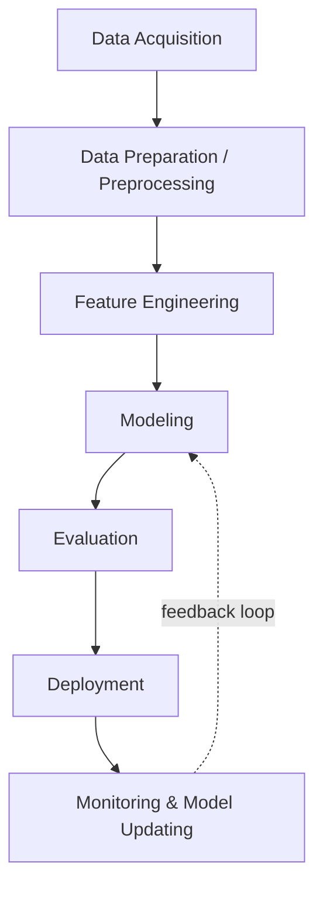
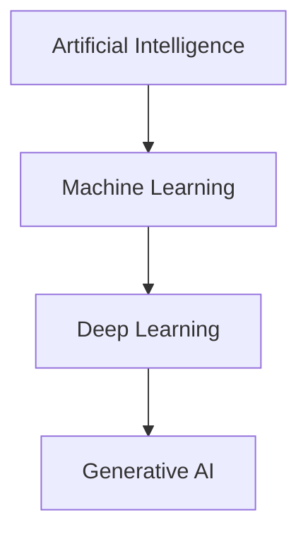
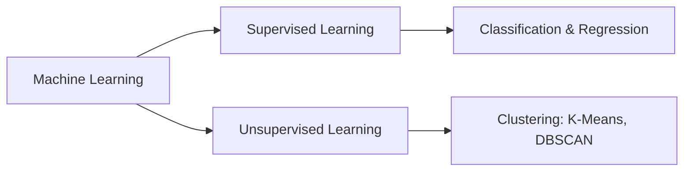

# Introduction to Generative AI, LLMs & the GenAI Pipeline

## 🎯 Learning Goal

By the end of this note, you should understand:
- What Generative AI and LLMs actually are (in plain English)
- Why we need generative models at all
- Where GenAI fits inside the AI → ML → DL family tree
- The end-to-end steps (pipeline) used to build a GenAI application, from raw data to a deployed, monitored product

---

## 🤔 What is it?

**Generative AI** is AI that *creates new content* — text, images, audio, or video — instead of just analyzing or labeling existing content. It learns patterns from huge amounts of training data, then uses those patterns to generate something new that looks similar in style.

**LLM (Large Language Model)** is a specific type of Generative AI that specializes in *language*. It's a deep learning model trained on massive amounts of text so it learns patterns, grammar, facts, and relationships between words. One LLM can do many jobs: write text, chat, summarize, translate, and even generate code.

> 🧑‍🎓 Analogy: Think of an LLM like a student who has read millions of books but doesn't actually "know" everything — it predicts the next most likely word based on patterns it has seen, not because it has real understanding or memory of facts.

---

## ❓ Why do we need it?

**Why Generative AI?**
- To understand complex patterns hidden in data
- To generate content (text, images, audio, video) instead of just retrieving it
- To build powerful applications on top of that content-generation ability (chatbots, image tools, code assistants, etc.)

**Why are LLMs so powerful specifically?**
- One single model can handle a *huge variety* of tasks — text generation, chatbots, summarization, translation, code generation — instead of needing a separate model per task.
- This makes LLMs a very efficient "general-purpose engine" for language work.

---

## 🧠 Key Idea

- Generative AI is a **subset** of Deep Learning, which is a subset of Machine Learning, which is a subset of Artificial Intelligence.
- Generative AI ≠ one thing — it splits into **Generative Image Models** and **Generative Language Models** (LLMs fall here).
- LLMs are trained on massive text datasets to learn patterns and relationships between words/entities — not to "memorize facts."
- Models are broadly either **Discriminative** (classify / distinguish between things) or **Generative** (create new things).
- Building a real GenAI product isn't just "call the model" — it requires a full pipeline: data → preprocessing → features → model → evaluation → deployment → monitoring.

---

## 📚 Important Terms

| Term | Simple Meaning | Example |
|------|----------------|----------|
| LLM (Large Language Model) | A deep learning model trained on huge text data to understand and generate language | ChatGPT, Claude |
| Generative Model | A model that creates new data similar to what it was trained on | An LLM writing a new paragraph |
| Discriminative Model | A model that tells categories apart, but doesn't create new data | A spam-or-not-spam email classifier |
| Corpus | The *entire* collection of text you're working with | All customer reviews in your dataset |
| Vocabulary | The set of *unique* words found in the corpus | {"cat", "dog", "run"} |
| Document | One single unit of text — usually one row/line | One customer review |
| Token | A single unit (word or sub-word) the model reads at a time | "pratham" → 1 token |
| Tokenization | Splitting text into smaller pieces (words or sentences) for the model to process | "I am Pratham" → ["I", "am", "Pratham"] |
| Stemming | Chopping a word down to a rough base form (fast but crude) | "running" → "run" |
| Lemmatization | Reducing a word to its correct dictionary base form (smarter than stemming) | "better" → "good" |
| Data Augmentation | Artificially creating more training data from existing data | Turning "I am a Data Scientist" into "I am an AI Engineer" |
| Feature Engineering | Converting raw text into numeric form a model can use | TF-IDF, Bag of Words |
| TF-IDF | A number that shows how *important* a word is in a document relative to the whole corpus | Rare-but-frequent words score high |
| Bag of Words | A simple way to represent text as word counts, ignoring order | "I love AI" → {I:1, love:1, AI:1} |

---

## 🔄 How it Works — The GenAI / NLP Pipeline

Step-by-step in simple language:

1. **Data Acquisition** — Collect the raw material. This could be files you already have (CSV, TXT, PDF, DOCX, XLSX), data pulled from a database/API/web scraping, or — if you have none — synthetic data generated using an LLM. If you have *too little* data, you use **Data Augmentation** (e.g., swap words with synonyms, flip word order, back-translate, or add noise) to stretch it further.
2. **Data Preparation / Preprocessing** — Clean the mess out of raw text (strip HTML tags, fix typos/emojis, spelling corrections). Then do **basic preprocessing**: tokenization (splitting into words/sentences), optionally stop-word removal, stemming/lemmatization, punctuation removal, lower-casing, and language detection. For harder problems, do **advanced preprocessing**: POS (part-of-speech) tagging, parse-tree parsing, coreference resolution.
3. **Feature Engineering** — Turn cleaned text into numbers the model can actually use: TF-IDF, Bag of Words, word-to-weight schemes, or letting a Transformer model generate embeddings directly.
4. **Modeling** — Pick a model to solve the problem. This could be an open-source LLM or a paid/hosted model API.
5. **Evaluation** — Check if the model is actually good.
   - **Intrinsic evaluation**: metric-based checks done by the GenAI engineer (accuracy, BLEU, perplexity, etc.)
   - **Extrinsic evaluation**: how it performs once actually deployed / used by real users
6. **Deployment** — Ship the model into a real product/environment.
7. **Monitoring & Model Updating** — Keep watching how it performs in the real world and retrain/update it as needed. This feeds back into modeling — the pipeline is a loop, not a one-way street.

---

## 🌍 Real-Life Example

Think of a **restaurant kitchen**:
- **Data Acquisition** = buying raw ingredients from the market
- **Preprocessing** = washing, peeling, cutting the vegetables
- **Feature Engineering** = measuring and portioning ingredients into the exact quantities a recipe needs
- **Modeling** = the chef actually cooking the dish
- **Evaluation** = tasting the dish before it leaves the kitchen
- **Deployment** = serving it to the customer
- **Monitoring** = getting customer feedback and tweaking the recipe next time

---

## 💻 Technical Example

- **Generative AI in action**: An LLM given the prompt "Write a birthday message for my friend" generates brand-new text word by word — it wasn't copy-pasted from training data, it was *predicted*.
- **Discriminative model in action**: A spam filter looks at an email's features (words, sender, links) and outputs a label: `spam` or `not spam` — it doesn't generate anything new, it just classifies.
- **Pipeline in action**: Raw customer reviews (CSV) → cleaned + tokenized text → TF-IDF vectors → fed into a sentiment classification model → accuracy checked → deployed as an API → monitored for drift over time.

---

## 🖼 Visual Representation

**Where Generative AI sits in the AI family tree:**

- Machine Learning is a subset of Artificial Intelligence
- Deep Learning is a subset of Machine Learning
- Generative AI is a subset of Deep Learning

**Learning types feeding into modeling:**

---

## ⚖ Comparison

**Discriminative vs Generative Models**

| Discriminative Model | Generative Model |
|-----------------------|-------------------|
| Learns to tell categories apart | Learns to create new, similar data |
| Example: spam classifier | Example: LLM writing a new email |
| Answers "which class is this?" | Answers "what would new data like this look like?" |

**Stemming vs Lemmatization**

| Stemming | Lemmatization |
|----------|----------------|
| Crude, rule-based chopping | Smarter, dictionary-based reduction |
| Faster, less accurate | Slower, more accurate |
| "running" → "runn" (sometimes ugly) | "running" → "run" (correct word) |
| Less commonly preferred | More commonly preferred |

---

## 💡 Easy Trick to Remember

> 📌 **AI ⊃ ML ⊃ DL ⊃ GenAI** — like Russian nesting dolls, each one lives *inside* the bigger one.

> 📌 **Discriminative = Judge** (decides which category), **Generative = Artist** (creates something new).

> 📌 **Pipeline order** — remember "**A**cquire, **P**repare, **F**eature, **M**odel, **E**valuate, **D**eploy, **M**onitor" as *"A Person Found My Extra Diamond Merchant"* (silly sentence, but it sticks).

---

## ⚠ Common Misconceptions

❌ LLMs "know" everything and understand facts like a human.
✅ LLMs predict the next most likely word based on patterns learned from training data — they don't "know" in a human sense.

❌ Generative AI is just about chatbots/text.
✅ Generative AI also covers images, audio, and video generation — text (LLMs) is just one branch.

❌ Stemming and lemmatization do the same thing.
✅ Stemming is a crude chop; lemmatization is a smarter, dictionary-aware reduction to the correct base word.

❌ You always need a huge dataset to start a GenAI project.
✅ If you have little data, you can use Data Augmentation (synonym replacement, bigram flips, back-translation) to expand it.

---

## 🔍 Interview Questions

- What is Generative AI, and how is it different from Discriminative AI?
- What is an LLM, and why can one LLM handle many different tasks?
- Where does Generative AI sit relative to AI, ML, and Deep Learning?
- What are the steps of a typical GenAI/NLP pipeline?
- What's the difference between stemming and lemmatization?
- Why would you use Data Augmentation, and how?
- What's the difference between intrinsic and extrinsic evaluation?
- What is a corpus, and how is it different from a vocabulary?

---

## 📝 Quick Revision

- Generative AI creates new content (text, image, audio, video); Discriminative AI just classifies.
- AI → ML → DL → Generative AI, each nested inside the previous.
- LLMs are trained on massive text data to learn language patterns, not to memorize facts.
- One LLM can do many tasks: chat, summarize, translate, generate code.
- GenAI pipeline: Data Acquisition → Preprocessing → Feature Engineering → Modeling → Evaluation → Deployment → Monitoring.
- If data is scarce, use Data Augmentation (synonym swap, bigram flip, back-translation, noise).
- Preprocessing = cleanup + tokenization + optional steps (stop-word removal, stemming/lemmatization, lower-casing).
- Feature Engineering turns text into numbers: TF-IDF, Bag of Words, embeddings.
- Evaluation has two flavors: intrinsic (metrics) and extrinsic (real-world deployment performance).
- The pipeline is a loop — monitoring feeds back into modeling for retraining.

---

## 🎓 Cheat Sheet

| Concept | One-Line Meaning |
|----------|------------------|
| Generative AI | AI that creates new content |
| LLM | A deep learning model specialized in understanding/generating language |
| Discriminative Model | A model that classifies/distinguishes categories |
| Corpus | The full collection of text |
| Vocabulary | The set of unique words in the corpus |
| Tokenization | Splitting text into words/sentences |
| Stemming | Crude chopping to a base word form |
| Lemmatization | Dictionary-correct reduction to a base word |
| TF-IDF | Score showing how important a word is to a document |
| Bag of Words | Text represented as word counts |
| Data Augmentation | Creating more training data artificially |
| Intrinsic Evaluation | Metric-based evaluation done pre-deployment |
| Extrinsic Evaluation | Real-world evaluation post-deployment |

---

## 📖 Related Topics

Next topics to learn:
- Transformers
- Tokens & Embeddings
- Context Window
- Prompt Engineering
- RAG (Retrieval-Augmented Generation)
- Vector Databases
- Fine-tuning vs RAG

---

## ✅ Key Takeaways

1. Generative AI creates new content; it's a nested subset of AI → ML → Deep Learning.
2. LLMs are language-specialized generative models that predict the next word — they don't "know" facts.
3. Models split broadly into Discriminative (classify) vs Generative (create).
4. A real GenAI product needs a full pipeline: Data Acquisition → Preprocessing → Feature Engineering → Modeling → Evaluation → Deployment → Monitoring.
5. When data is limited, Data Augmentation techniques (synonym swap, bigram flip, back-translation) can stretch it further.
