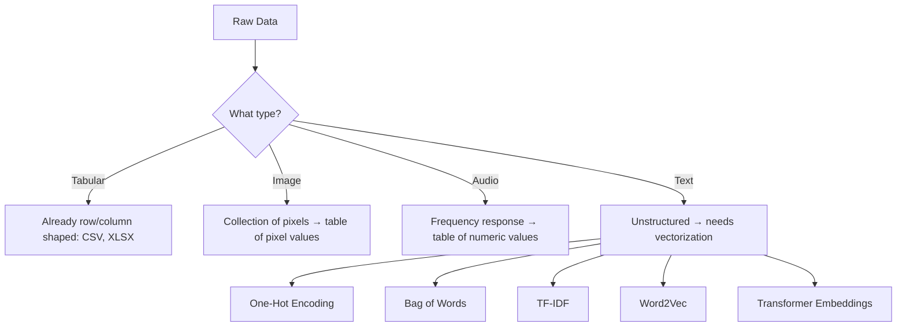
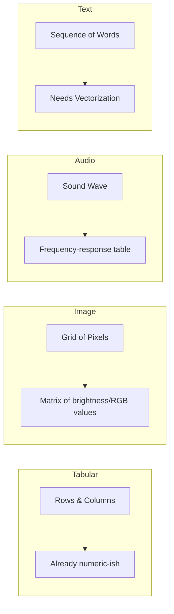

# Data Representation & Vectorization

## 🎯 Learning Goal

By the end of this note, you should understand:
- How different types of data (tabular, image, audio, text) get represented in a form a model can use
- Why text is the trickiest type to represent (it's unstructured)
- How One-Hot Encoding and Bag of Words work, and why they fall short
- What better alternatives exist (TF-IDF, Word2Vec, Transformers)

---

## 🤔 What is it?

**Data Representation** is the process of converting raw data (images, audio, text, tables) into a numeric format — usually a table or matrix of numbers — that a machine learning model can actually process. Models don't understand pixels, sound waves, or sentences directly; everything has to become numbers first.

> 🧑‍🎓 Analogy: Think of data representation like translating a book into a language a computer understands. The *story* (meaning) stays the same, but the *format* changes completely — from words on a page to rows and columns of numbers.

---

## ❓ Why do we need it?

- Machine learning models are just math — they can only work with numbers, not raw pixels, sound, or free-flowing sentences.
- Every data type is naturally shaped differently (an image is a grid, audio is a wave, text is a sequence of words), so each needs its **own conversion method** into a table/matrix form.
- Text is especially tricky because it's **unstructured** — sentences vary in length, word order matters, and there's no natural fixed number of columns like a spreadsheet has.

---

## 🧠 Key Idea

- Every data type — tabular, image, audio, text — can eventually be converted into a **table/matrix representation** of numbers.
- **Images** = collections of pixels, and each pixel's value (brightness/color) can be laid out as a table.
- **Audio** = represented using tables based on frequency responses (how much of each frequency is present).
- **Text** is the hardest case, because it's **unstructured data** — this is why we need special "text vectorization" methods like One-Hot Encoding, Bag of Words, TF-IDF, Word2Vec, and Transformers.
- A sentence like *"My name is Pratham"* has 4 **tokens** (words) — but different sentences have different lengths, which creates a **dimensional input issue** (models need a *fixed*-size input, not a variable one).

---

## 📚 Important Terms

| Term | Simple Meaning | Example |
|------|----------------|----------|
| Pixel | The smallest unit of a digital image, holding a color/brightness value | A photo is a grid of thousands of pixels |
| Frequency Response | How much of each sound frequency is present in an audio clip | Used to turn audio into numeric/table form |
| Token | A single unit (usually a word) that text is split into | "My name is Pratham" → 4 tokens |
| Unstructured Data | Data with no fixed row/column shape — like free text | Sentences of varying length |
| Corpus | The entire collection of documents/text you're working with | All 3 reviews (D1–D3) together |
| Vocabulary | The set of unique words across the whole corpus | {the, movie, was, great, boring, acting, story} |
| Document | One single piece/row of text in the corpus | D1: "the movie was great" |
| One-Hot Encoding | Representing each word as a vector with a single "1" and the rest "0"s | "cat" → [1,0,0,0] if vocabulary = [cat, dog, fish, bird] |
| Bag of Words (BoW) | Representing a document by counting how many times each vocabulary word appears, ignoring order | "I love AI, AI loves me" → {I:1, love:1, AI:2, loves:1, me:1} |
| Sparse Matrix | A matrix mostly filled with zeros | One-hot encoded vectors for a big vocabulary |
| Out-of-Vocabulary (OOV) | A new word appears that wasn't seen in the training vocabulary | Model has never seen "cryptocurrency" before |
| TF-IDF | A score showing how important a word is to a document relative to the whole corpus | Rare-but-frequent-in-this-doc words score higher |
| Word2Vec | A technique that represents words as dense vectors capturing meaning/relationships | "king" - "man" + "woman" ≈ "queen" |
| Transformer | A modern deep learning architecture that creates context-aware representations of text | Powers models like BERT, GPT |

---

## 🔄 How it Works



Step-by-step in simple language:

1. **Identify the data type** — tabular data is already numeric-ish (rows and columns), but images, audio, and text are not.
2. **Images** → broken down into pixels, and each pixel's value gets placed into a table.
3. **Audio** → broken down using frequency response analysis into a table of numbers.
4. **Text** → since it's unstructured (no fixed shape), it needs a **vectorization** method before a model can use it: One-Hot Encoding, Bag of Words, TF-IDF, Word2Vec, or Transformer embeddings (from simplest/oldest to most powerful/modern).

---

## 🧩 How Each Raw Data Type Actually Gets Handled

Each data type starts in a completely different "shape," so each needs its own translation step into a table/matrix of numbers before a model can touch it.

### 1. Tabular Data (CSV, XLSX)

Tabular data is the easiest — it's *already* rows and columns. The only work needed is making sure every column is numeric (e.g., converting a "Yes/No" column into `1/0`, or a "City" column into category codes).

```
Raw CSV                          Model-ready table
┌────────┬──────┬────────┐       ┌────────┬──────┬────────┐
│ Name   │ Age  │ Bought │  ──►  │ Name   │ Age  │ Bought │
├────────┼──────┼────────┤       ├────────┼──────┼────────┤
│ Asha   │ 28   │ Yes    │       │ Asha   │ 28   │   1    │
│ Ravi   │ 34   │ No     │       │ Ravi   │ 34   │   0    │
└────────┴──────┴────────┘       └────────┴──────┴────────┘
```

### 2. Image Data

An image is really just a **grid of pixels**, and every pixel is a number (or 3 numbers for color: Red, Green, Blue). A small grayscale image, say 4×4 pixels, is *literally already a matrix* of brightness values from 0 (black) to 255 (white) — no extra "conversion trick" needed, it's numeric by nature.

```
Image (4x4 grayscale)              Pixel-value matrix
┌───┬───┬───┬───┐                  ┌─────┬─────┬─────┬─────┐
│ ▪ │ ▪ │ □ │ □ │                  │ 240 │ 230 │ 20  │ 10  │
├───┼───┼───┼───┤        ──►       ├─────┼─────┼─────┼─────┤
│ ▪ │ □ │ □ │ ▪ │                  │ 220 │ 15  │ 25  │ 210 │
├───┼───┼───┼───┤                  ├─────┼─────┼─────┼─────┤
│ □ │ □ │ ▪ │ ▪ │                  │ 30  │ 18  │ 235 │ 225 │
└───┴───┴───┴───┘                  └─────┴─────┴─────┴─────┘
```

A color image just stacks **3 of these grids** on top of each other (one for Red, one for Green, one for Blue) — this stack is called a "3-channel" image.

### 3. Audio Data

Raw audio is a continuous **sound wave** (amplitude changing over time). To make it usable, we break the wave into tiny time-windows and measure how much of each **frequency** (pitch) is present in each window — this produces a table where rows = time windows and columns = frequency bands.

```
Sound Wave (amplitude over time)
   │      ╭╮        ╭─╮
   │  ╭╮ ╭╯╰╮   ╭╮ ╭╯ ╰╮
───┼──╯╰─╯──╰───╯╰─╯───╰──── time ──►
   │
        │
        ▼  (split into windows + measure frequencies)

Frequency-response table
┌─────────────┬────────┬────────┬────────┐
│ Time Window │ Low Hz │ Mid Hz │ High Hz│
├─────────────┼────────┼────────┼────────┤
│ 0.0s–0.1s   │  0.8   │ 0.3    │ 0.1    │
│ 0.1s–0.2s   │  0.2   │ 0.9    │ 0.4    │
│ 0.2s–0.3s   │  0.1   │ 0.2    │ 0.7    │
└─────────────┴────────┴────────┴────────┘
```

This is essentially a "spectrogram" — a picture of sound over time, which can then be fed into a model the same way an image is.

### 4. Text Data (the odd one out)

Unlike the other three, text has **no natural numeric form at all** — a sentence isn't a wave or a grid, it's just a variable-length sequence of symbols. That's why text is the only data type here that needs a dedicated *vectorization* step (One-Hot Encoding, Bag of Words, TF-IDF, Word2Vec, Transformers — covered in detail below) instead of a direct, mechanical conversion.



> 💡 Key takeaway from this comparison: Tabular, Image, and Audio data are **naturally numeric** — the conversion is mostly mechanical (reshape/measure). Text is **not naturally numeric** — it requires a modeling *choice* (which vectorization method to use), which is why so much of NLP is dedicated to solving this one problem well.

---

## 🌍 Real-Life Example

Think of a **library card catalog**:
- Every book (document) gets described using a fixed set of categories (columns) — author, genre, year, rating.
- Even though books have wildly different content and lengths, the catalog forces them into a consistent table so you can search and compare them.
- Text vectorization does the same thing to sentences: it forces variable-length text into a fixed-size numeric row so a model can "search and compare" them mathematically.

---

## 💻 Technical Example

Let's use a tiny, realistic **movie review corpus** to see each method actually produce numbers.

```
D1: "the movie was great"
D2: "the movie was boring"
D3: "great acting great story"
```

**Step 1 — Bag of Words (word counts)**

Vocabulary (unique words across all 3 docs): `the, movie, was, great, boring, acting, story`

| | the | movie | was | great | boring | acting | story |
|---|---|---|---|---|---|---|---|
| D1 | 1 | 1 | 1 | 1 | 0 | 0 | 0 |
| D2 | 1 | 1 | 1 | 0 | 1 | 0 | 0 |
| D3 | 0 | 0 | 0 | 2 | 0 | 1 | 1 |

This is exactly what `sklearn`'s `CountVectorizer` produces under the hood:

```python
from sklearn.feature_extraction.text import CountVectorizer

docs = ["the movie was great", "the movie was boring", "great acting great story"]
vectorizer = CountVectorizer()
bow_matrix = vectorizer.fit_transform(docs)

print(vectorizer.get_feature_names_out())
# ['acting' 'boring' 'great' 'movie' 'story' 'the' 'was']
print(bow_matrix.toarray())
# [[0 0 1 1 0 1 1]
#  [0 1 0 1 0 1 1]
#  [1 0 2 0 1 0 0]]
```

**Step 2 — Where this breaks down**

- Notice `great` appears **twice** in D3 — Bag of Words just counts it as `2`, but it can't tell whether that repetition means "extra great" or is just noisy phrasing.
- The word `the` appears in D1 and D2 constantly but carries almost no useful meaning — yet it gets treated with the same importance as `great` or `boring`. This is the exact problem **TF-IDF** fixes: it *down-weights* common words like "the" and *up-weights* rarer, more distinctive words like "boring" or "acting".
- If a new review comes in saying `"the cinematography was stunning"`, the words `cinematography` and `stunning` are **Out-of-Vocabulary (OOV)** — they don't exist in our 7-word vocabulary, so a One-Hot/BoW model would have no column for them at all and effectively ignores them.

**Step 3 — Why meaning still gets lost (and how Word2Vec/Transformers fix it)**

- In the BoW table above, `great` and `boring` are just two unrelated columns — mathematically as different as `great` and `story`. The model has no idea that `great` and `amazing` mean almost the same thing.
- **Word2Vec** fixes this by placing words in a "meaning space" where similar words land close together — so `great` and `amazing` would have vectors that are numerically close, even though they're spelled completely differently.
- **Transformers** go one step further: the word `great` in *"the movie was great"* vs. the same word in *"that's a great way to lose money"* (sarcastic) gets a **different** embedding each time, because Transformers read the surrounding context before deciding what a word "means" in that sentence — something BoW, TF-IDF, and even Word2Vec cannot do.

---

## 🖼 Visual Representation

```
Raw Data
   │
   ├── Tabular (CSV/XLSX) ──────────► Already table-shaped
   ├── Image ───────► Pixels ───────► Table of pixel values
   ├── Audio ───────► Frequency ────► Table of frequency values
   └── Text ────────► Unstructured ─► Needs Vectorization
                                        │
                        ┌───────────────┼────────────────┐
                        ▼               ▼                ▼
                  One-Hot Encoding  Bag of Words     TF-IDF / Word2Vec /
                  (sparse, simple)  (word counts)    Transformer (dense, smarter)
```

---

## ⚖ Comparison

| Method | How it works | Main Drawback |
|--------|--------------|----------------|
| One-Hot Encoding | Each word = a vector with a single 1, rest 0s | Very sparse, no fixed size across vocab growth, OOV issue, no semantic meaning |
| Bag of Words | Counts word occurrences per document | Ignores word order/context, still sparse |
| TF-IDF | Weighs words by importance, not just raw count | Still doesn't capture deep meaning/context |
| Word2Vec | Dense vectors that capture word meaning/relationships | Doesn't adapt meaning based on sentence context |
| Transformer | Context-aware embeddings (same word, different meaning per sentence) | Computationally heavier, needs more data/resources |

---

## 💡 Easy Trick to Remember

> 📌 **One-Hot Encoding = a single light switch ON in a huge room of switches** — one word, one "1", everything else "0". Wasteful (sparse) but simple.

> 📌 **Bag of Words = throwing all the words from a sentence into a bag and just counting them** — you know *what* words were used, but not the *order* they came in.

> 📌 Remember the upgrade path: **One-Hot → Bag of Words → TF-IDF → Word2Vec → Transformer**, going from "dumb counting" to "true understanding of meaning."

---

## ⚠ Common Misconceptions

❌ All data types are represented the same way.
✅ Each data type (image, audio, text, tabular) needs its own conversion approach into table/numeric form.

❌ One-Hot Encoding captures the meaning of a word.
✅ One-Hot Encoding only marks *presence*, not meaning — "cat" and "kitten" look completely unrelated to it, even though they're similar in meaning.

❌ Bag of Words understands sentence structure.
✅ Bag of Words only counts word frequency — it completely ignores word order, so "dog bites man" and "man bites dog" look identical to it.

❌ A bigger vocabulary always means a better model.
✅ A bigger vocabulary makes One-Hot/BoW vectors more sparse and harder to compute with — this is exactly the sparsity drawback.

---

## 🔍 Interview Questions

- Why does text data need special handling compared to tabular data?
- What is the difference between One-Hot Encoding and Bag of Words?
- What are the drawbacks of One-Hot Encoding?
- What is the Out-of-Vocabulary (OOV) problem, and why does it happen?
- Why is a Bag of Words matrix usually sparse?
- How does TF-IDF improve on plain Bag of Words?
- How is Word2Vec different from One-Hot Encoding in terms of capturing meaning?
- Why do Transformers produce better text representations than Word2Vec?

---

## 📝 Quick Revision

- Data representation converts any raw data type into a numeric table/matrix a model can use.
- Tabular data is naturally table-shaped; images become pixel tables; audio becomes frequency-response tables.
- Text is unstructured, so it needs vectorization: One-Hot Encoding, Bag of Words, TF-IDF, Word2Vec, or Transformer embeddings.
- A corpus is the full text collection; vocabulary is the set of unique words in it; a document is one row/unit of text.
- One-Hot Encoding marks word presence with a single "1" — simple but sparse, fixed-size-limited, OOV-prone, and meaning-blind.
- Bag of Words counts word frequency per document but still ignores word order.
- Sparse matrices (mostly zeros) are the main computational drawback of One-Hot/BoW approaches.
- TF-IDF improves on BoW by weighing word importance, not just raw counts.
- Word2Vec and Transformers produce dense, meaning-aware vectors — a big upgrade over sparse counting methods.
- The general trend: older methods (One-Hot, BoW) = simple but dumb; newer methods (Word2Vec, Transformer) = complex but capture real meaning.

---

## 🎓 Cheat Sheet

| Concept | One-Line Meaning |
|----------|------------------|
| Data Representation | Turning raw data into numbers a model can use |
| Pixel | Smallest numeric unit of an image |
| Frequency Response | Numeric representation of audio |
| Token | A single word/unit of text |
| Corpus | The full text collection |
| Vocabulary | Unique words across the corpus |
| One-Hot Encoding | Word = vector with a single 1 |
| Bag of Words | Word counts per document |
| Sparse Matrix | Matrix mostly made of zeros |
| OOV | A word not seen during training |
| TF-IDF | Importance-weighted word score |
| Word2Vec | Dense, meaning-aware word vectors |
| Transformer | Context-aware text embeddings |

---

## 📖 Related Topics

Next topics to learn:
- TF-IDF (in depth)
- Word2Vec & embeddings
- Transformers & attention mechanism
- Tokens & Context Window
- Vector Databases (for storing embeddings)
- Prompt Engineering

---

## ✅ Key Takeaways

1. Every data type needs its own path to become a numeric table: images → pixels, audio → frequency response, text → vectorization.
2. Text is unstructured and variable-length, which creates a dimensional input problem models can't handle directly.
3. One-Hot Encoding and Bag of Words are simple but suffer from sparsity, no fixed size across vocab, OOV issues, and no real semantic meaning.
4. TF-IDF, Word2Vec, and Transformers are progressively smarter upgrades that better capture word importance and meaning.
5. A corpus/vocabulary/document framework (like the movie-review D1–D3 example) is the foundation for understanding how text vectorization tables are built.
