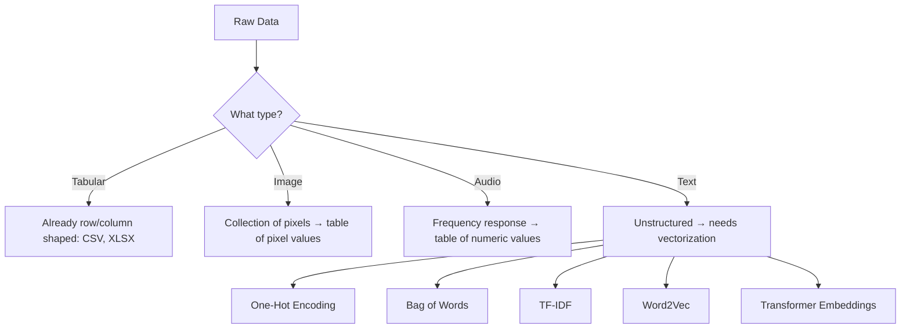
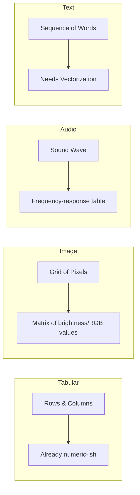
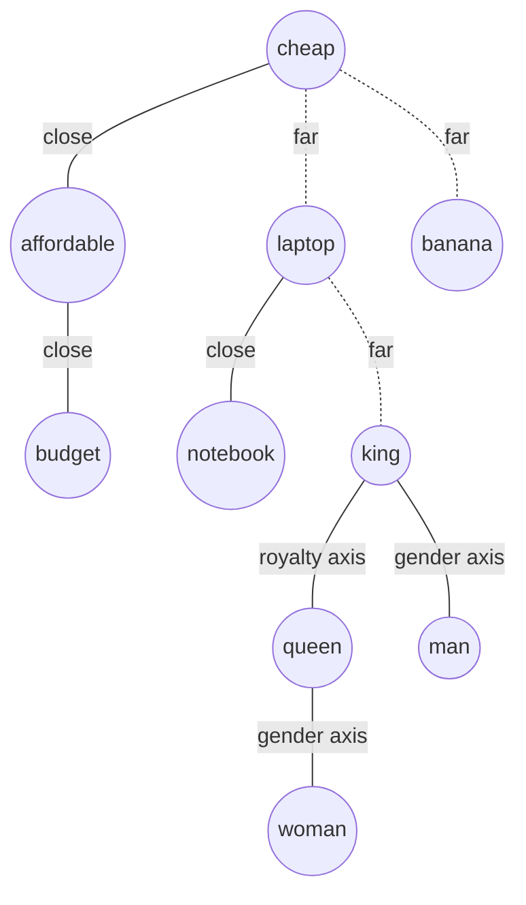
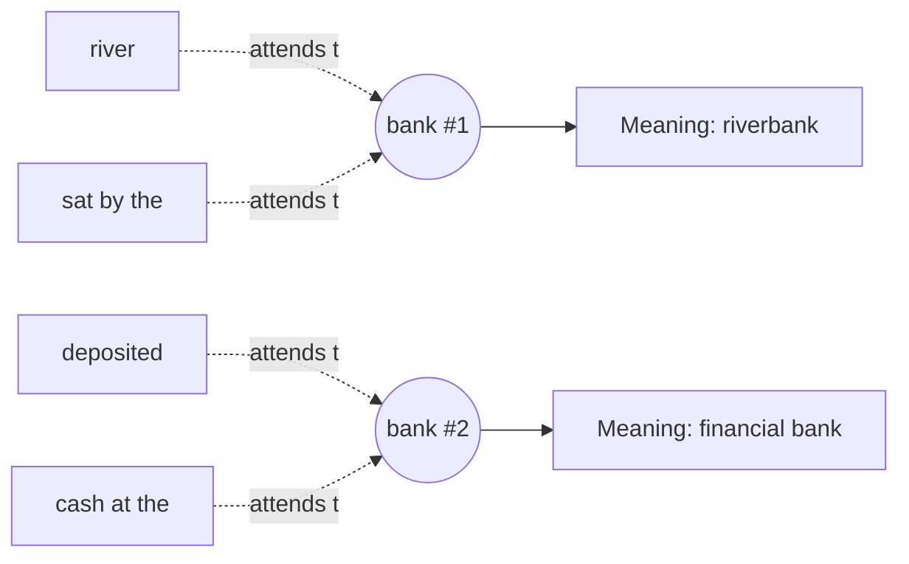
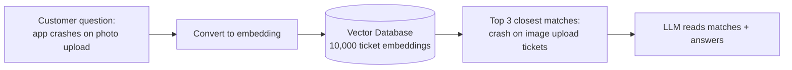
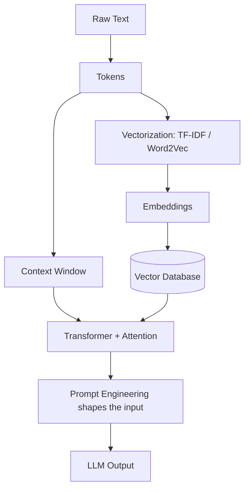

# Data Representation & Vectorization

## 🎯 Learning Goal

By the end of this note, you should understand:
- How different types of data (tabular, image, audio, text) get represented in a form a model can use
- Why text is the trickiest type to represent (it's unstructured)
- How One-Hot Encoding and Bag of Words work, and why they fall short
- What better alternatives exist (TF-IDF, Word2Vec, Transformers)

---

## 🤔 What is it?

**Data Representation** is the process of converting raw data (images, audio, text, tables) into a numeric format — usually a table or matrix of numbers — that a machine learning model can actually process. Models don't understand pixels, sound waves, or sentences directly; everything has to become numbers first.

> 🧑‍🎓 Analogy: Think of data representation like translating a book into a language a computer understands. The *story* (meaning) stays the same, but the *format* changes completely — from words on a page to rows and columns of numbers.

---

## ❓ Why do we need it?

- Machine learning models are just math — they can only work with numbers, not raw pixels, sound, or free-flowing sentences.
- Every data type is naturally shaped differently (an image is a grid, audio is a wave, text is a sequence of words), so each needs its **own conversion method** into a table/matrix form.
- Text is especially tricky because it's **unstructured** — sentences vary in length, word order matters, and there's no natural fixed number of columns like a spreadsheet has.

---

## 🧠 Key Idea

- Every data type — tabular, image, audio, text — can eventually be converted into a **table/matrix representation** of numbers.
- **Images** = collections of pixels, and each pixel's value (brightness/color) can be laid out as a table.
- **Audio** = represented using tables based on frequency responses (how much of each frequency is present).
- **Text** is the hardest case, because it's **unstructured data** — this is why we need special "text vectorization" methods like One-Hot Encoding, Bag of Words, TF-IDF (Term Frequency – Inverse Document Frequency), Word2Vec, and Transformers.
- A sentence like *"My name is Pratham"* has 4 **tokens** (words) — but different sentences have different lengths, which creates a **dimensional input issue** (models need a *fixed*-size input, not a variable one).

---

## 📚 Important Terms

| Term | Simple Meaning | Example |
|------|----------------|----------|
| Pixel | The smallest unit of a digital image, holding a color/brightness value | A photo is a grid of thousands of pixels |
| Frequency Response | How much of each sound frequency is present in an audio clip | Used to turn audio into numeric/table form |
| Token | A single unit (usually a word) that text is split into | "My name is Pratham" → 4 tokens |
| Unstructured Data | Data with no fixed row/column shape — like free text | Sentences of varying length |
| Corpus | The entire collection of documents/text you're working with | All 3 reviews (D1–D3) together |
| Vocabulary | The set of unique words across the whole corpus | {the, movie, was, great, boring, acting, story} |
| Document | One single piece/row of text in the corpus | D1: "the movie was great" |
| One-Hot Encoding | Representing each word as a vector with a single "1" and the rest "0"s | "cat" → [1,0,0,0] if vocabulary = [cat, dog, fish, bird] |
| Bag of Words (BoW) | Representing a document by counting how many times each vocabulary word appears, ignoring order | "I love AI, AI loves me" → {I:1, love:1, AI:2, loves:1, me:1} |
| Sparse Matrix | A matrix mostly filled with zeros | One-hot encoded vectors for a big vocabulary |
| Out-of-Vocabulary (OOV) | A new word appears that wasn't seen in the training vocabulary | Model has never seen "cryptocurrency" before |
| TF-IDF (Term Frequency – Inverse Document Frequency) | A score showing how important a word is to a document relative to the whole corpus | Rare-but-frequent-in-this-doc words score higher |
| Word2Vec | A technique that represents words as dense vectors capturing meaning/relationships | "king" - "man" + "woman" ≈ "queen" |
| CBOW (Continuous Bag of Words) | A Word2Vec training method that predicts a missing center word from its surrounding context words | Given "The ___ sat on the mat", predicts "cat" |
| Skip-gram | A Word2Vec training method that predicts the surrounding context words from a single center word | Given "cat", predicts "the," "sat," "on," "mat" |
| Transformer | A modern deep learning architecture that creates context-aware representations of text | Powers models like BERT, GPT |

---

## 🔄 How it Works



Step-by-step in simple language:

1. **Identify the data type** — tabular data is already numeric-ish (rows and columns), but images, audio, and text are not.
2. **Images** → broken down into pixels, and each pixel's value gets placed into a table.
3. **Audio** → broken down using frequency response analysis into a table of numbers.
4. **Text** → since it's unstructured (no fixed shape), it needs a **vectorization** method before a model can use it: One-Hot Encoding, Bag of Words, TF-IDF, Word2Vec, or Transformer embeddings (from simplest/oldest to most powerful/modern).

---

## 🧩 How Each Raw Data Type Actually Gets Handled

Each data type starts in a completely different "shape," so each needs its own translation step into a table/matrix of numbers before a model can touch it.

### 1. Tabular Data (CSV, XLSX)

Tabular data is the easiest — it's *already* rows and columns. The only work needed is making sure every column is numeric (e.g., converting a "Yes/No" column into `1/0`, or a "City" column into category codes).

```
Raw CSV                          Model-ready table
┌────────┬──────┬────────┐       ┌────────┬──────┬────────┐
│ Name   │ Age  │ Bought │  ──►  │ Name   │ Age  │ Bought │
├────────┼──────┼────────┤       ├────────┼──────┼────────┤
│ Asha   │ 28   │ Yes    │       │ Asha   │ 28   │   1    │
│ Ravi   │ 34   │ No     │       │ Ravi   │ 34   │   0    │
└────────┴──────┴────────┘       └────────┴──────┴────────┘
```

### 2. Image Data

An image is really just a **grid of pixels**, and every pixel is a number (or 3 numbers for color: Red, Green, Blue). A small grayscale image, say 4×4 pixels, is *literally already a matrix* of brightness values from 0 (black) to 255 (white) — no extra "conversion trick" needed, it's numeric by nature.

```
Image (4x4 grayscale)              Pixel-value matrix
┌───┬───┬───┬───┐                  ┌─────┬─────┬─────┬─────┐
│ ▪ │ ▪ │ □ │ □ │                  │ 240 │ 230 │ 20  │ 10  │
├───┼───┼───┼───┤        ──►       ├─────┼─────┼─────┼─────┤
│ ▪ │ □ │ □ │ ▪ │                  │ 220 │ 15  │ 25  │ 210 │
├───┼───┼───┼───┤                  ├─────┼─────┼─────┼─────┤
│ □ │ □ │ ▪ │ ▪ │                  │ 30  │ 18  │ 235 │ 225 │
└───┴───┴───┴───┘                  └─────┴─────┴─────┴─────┘
```

A color image just stacks **3 of these grids** on top of each other (one for Red, one for Green, one for Blue) — this stack is called a "3-channel" image.

### 3. Audio Data

Raw audio is a continuous **sound wave** (amplitude changing over time). To make it usable, we break the wave into tiny time-windows and measure how much of each **frequency** (pitch) is present in each window — this produces a table where rows = time windows and columns = frequency bands.

```
Sound Wave (amplitude over time)
   │      ╭╮        ╭─╮
   │  ╭╮ ╭╯╰╮   ╭╮ ╭╯ ╰╮
───┼──╯╰─╯──╰───╯╰─╯───╰──── time ──►
   │
        │
        ▼  (split into windows + measure frequencies)

Frequency-response table
┌─────────────┬────────┬────────┬────────┐
│ Time Window │ Low Hz │ Mid Hz │ High Hz│
├─────────────┼────────┼────────┼────────┤
│ 0.0s–0.1s   │  0.8   │ 0.3    │ 0.1    │
│ 0.1s–0.2s   │  0.2   │ 0.9    │ 0.4    │
│ 0.2s–0.3s   │  0.1   │ 0.2    │ 0.7    │
└─────────────┴────────┴────────┴────────┘
```

This is essentially a "spectrogram" — a picture of sound over time, which can then be fed into a model the same way an image is.

### 4. Text Data (the odd one out)

Unlike the other three, text has **no natural numeric form at all** — a sentence isn't a wave or a grid, it's just a variable-length sequence of symbols. That's why text is the only data type here that needs a dedicated *vectorization* step (One-Hot Encoding, Bag of Words, TF-IDF, Word2Vec, Transformers — covered in detail below) instead of a direct, mechanical conversion.



> 💡 Key takeaway from this comparison: Tabular, Image, and Audio data are **naturally numeric** — the conversion is mostly mechanical (reshape/measure). Text is **not naturally numeric** — it requires a modeling *choice* (which vectorization method to use), which is why so much of NLP is dedicated to solving this one problem well.

---

## 🌍 Real-Life Example

Think of a **library card catalog**:
- Every book (document) gets described using a fixed set of categories (columns) — author, genre, year, rating.
- Even though books have wildly different content and lengths, the catalog forces them into a consistent table so you can search and compare them.
- Text vectorization does the same thing to sentences: it forces variable-length text into a fixed-size numeric row so a model can "search and compare" them mathematically.

---

## 💻 Technical Example

Let's use a tiny, realistic **movie review corpus** to see each method actually produce numbers.

```
D1: "the movie was great"
D2: "the movie was boring"
D3: "great acting great story"
```

**Step 1 — Bag of Words (word counts)**

Vocabulary (unique words across all 3 docs): `the, movie, was, great, boring, acting, story`

| | the | movie | was | great | boring | acting | story |
|---|---|---|---|---|---|---|---|
| D1 | 1 | 1 | 1 | 1 | 0 | 0 | 0 |
| D2 | 1 | 1 | 1 | 0 | 1 | 0 | 0 |
| D3 | 0 | 0 | 0 | 2 | 0 | 1 | 1 |

This is exactly what `sklearn`'s `CountVectorizer` produces under the hood:

```python
from sklearn.feature_extraction.text import CountVectorizer

docs = ["the movie was great", "the movie was boring", "great acting great story"]
vectorizer = CountVectorizer()
bow_matrix = vectorizer.fit_transform(docs)

print(vectorizer.get_feature_names_out())
# ['acting' 'boring' 'great' 'movie' 'story' 'the' 'was']
print(bow_matrix.toarray())
# [[0 0 1 1 0 1 1]
#  [0 1 0 1 0 1 1]
#  [1 0 2 0 1 0 0]]
```

**Step 2 — Where this breaks down**

- Notice `great` appears **twice** in D3 — Bag of Words just counts it as `2`, but it can't tell whether that repetition means "extra great" or is just noisy phrasing.
- The word `the` appears in D1 and D2 constantly but carries almost no useful meaning — yet it gets treated with the same importance as `great` or `boring`. This is the exact problem **TF-IDF** fixes: it *down-weights* common words like "the" and *up-weights* rarer, more distinctive words like "boring" or "acting".
- If a new review comes in saying `"the cinematography was stunning"`, the words `cinematography` and `stunning` are **Out-of-Vocabulary (OOV)** — they don't exist in our 7-word vocabulary, so a One-Hot/BoW model would have no column for them at all and effectively ignores them.

**Step 3 — Why meaning still gets lost (and how Word2Vec/Transformers fix it)**

- In the BoW table above, `great` and `boring` are just two unrelated columns — mathematically as different as `great` and `story`. The model has no idea that `great` and `amazing` mean almost the same thing.
- **Word2Vec** fixes this by placing words in a "meaning space" where similar words land close together — so `great` and `amazing` would have vectors that are numerically close, even though they're spelled completely differently.
- **Transformers** go one step further: the word `great` in *"the movie was great"* vs. the same word in *"that's a great way to lose money"* (sarcastic) gets a **different** embedding each time, because Transformers read the surrounding context before deciding what a word "means" in that sentence — something BoW, TF-IDF, and even Word2Vec cannot do.

**Step 4 — From Vectors to a Decision: How a Model Says "Positive" or "Negative"**

Turning text into numbers (Steps 1–3) is only half the story — the model still has to **decide** something from those numbers. Sentiment analysis is the classic example: given a review's vector, output `positive` or `negative`.

Here's the intuition using our BoW vectors:

1. During training, the model sees many labeled reviews (`"great" review → positive`, `"boring" review → negative`) and learns a **weight for every word** — roughly, how much that word "pushes" a review toward positive or negative.

   | Word | Learned Weight | Meaning |
   |------|-----------------|---------|
   | great | +2.1 | strongly pushes toward positive |
   | acting | +0.8 | mildly pushes toward positive |
   | boring | -2.4 | strongly pushes toward negative |
   | movie | +0.0 | neutral, doesn't help either way |
   | the, was | +0.0 | neutral (this is why TF-IDF down-weighting these words helps) |

2. For a **new** review, the model multiplies each word's count in the BoW vector by its learned weight, and adds them all up into a single score.

   - D1: `"the movie was great"` → `great(1 × 2.1) + movie(1 × 0) + the(1×0) + was(1×0)` = **+2.1** → positive score → predicted **Positive**
   - D2: `"the movie was boring"` → `boring(1 × -2.4) + movie(0) + the(0) + was(0)` = **-2.4** → negative score → predicted **Negative**
   - D3: `"great acting great story"` → `great(2 × 2.1) + acting(1 × 0.8)` = **+5.0** → strongly positive score → predicted **Positive**

3. That raw score is squashed into a probability between 0 and 1 (using something like a **sigmoid function**), and a simple threshold decides the label:

   ```
   score > 0   →  probability > 0.5  →  label = Positive
   score < 0   →  probability < 0.5  →  label = Negative
   ```

**More examples to build intuition:**

| Review | Key Words Detected | Score Direction | Predicted Sentiment |
|--------|--------------------|--------------------|----------------------|
| "This phone has an amazing camera" | amazing (+) | strongly positive | ✅ Positive |
| "The delivery was late and the box was damaged" | late (−), damaged (−) | strongly negative | ❌ Negative |
| "Decent product, does the job" | decent (mild +), nothing strong | mildly positive | ✅ Positive (weak confidence) |
| "Worst customer service I've ever experienced" | worst (−), a very strong negative word | strongly negative | ❌ Negative |

> 💡 This is exactly why **word choice matters so much** to these models — a review's sentiment is essentially a weighted vote of its words. This also explains a classic failure case: *"the movie was not great"* — a simple BoW/TF-IDF model might still see `great` and vote positive, because it doesn't understand that `not` flips the meaning. Context-aware models (Word2Vec to a small extent, Transformers much more) are needed to correctly handle negation like this.

---

## 🖼 Visual Representation

```
Raw Data
   │
   ├── Tabular (CSV/XLSX) ──────────► Already table-shaped
   ├── Image ───────► Pixels ───────► Table of pixel values
   ├── Audio ───────► Frequency ────► Table of frequency values
   └── Text ────────► Unstructured ─► Needs Vectorization
                                        │
                        ┌───────────────┼────────────────┐
                        ▼               ▼                ▼
                  One-Hot Encoding  Bag of Words     TF-IDF / Word2Vec /
                  (sparse, simple)  (word counts)    Transformer (dense, smarter)
```

---

## ⚖ Comparison

| Method | How it works | Main Drawback |
|--------|--------------|----------------|
| One-Hot Encoding | Each word = a vector with a single 1, rest 0s | Very sparse, no fixed size across vocab growth, OOV issue, no semantic meaning |
| Bag of Words | Counts word occurrences per document | Ignores word order/context, still sparse |
| TF-IDF | Weighs words by importance, not just raw count | Still doesn't capture deep meaning/context |
| Word2Vec | Dense vectors that capture word meaning/relationships | Doesn't adapt meaning based on sentence context |
| Transformer | Context-aware embeddings (same word, different meaning per sentence) | Computationally heavier, needs more data/resources |

---

## 💡 Easy Trick to Remember

> 📌 **One-Hot Encoding = a single light switch ON in a huge room of switches** — one word, one "1", everything else "0". Wasteful (sparse) but simple.

> 📌 **Bag of Words = throwing all the words from a sentence into a bag and just counting them** — you know *what* words were used, but not the *order* they came in.

> 📌 Remember the upgrade path: **One-Hot → Bag of Words → TF-IDF → Word2Vec → Transformer**, going from "dumb counting" to "true understanding of meaning."

---

## ⚠ Common Misconceptions

❌ All data types are represented the same way.
✅ Each data type (image, audio, text, tabular) needs its own conversion approach into table/numeric form.

❌ One-Hot Encoding captures the meaning of a word.
✅ One-Hot Encoding only marks *presence*, not meaning — "cat" and "kitten" look completely unrelated to it, even though they're similar in meaning.

❌ Bag of Words understands sentence structure.
✅ Bag of Words only counts word frequency — it completely ignores word order, so "dog bites man" and "man bites dog" look identical to it.

❌ A bigger vocabulary always means a better model.
✅ A bigger vocabulary makes One-Hot/BoW vectors more sparse and harder to compute with — this is exactly the sparsity drawback.

---

## 🔍 Interview Questions

- Why does text data need special handling compared to tabular data?
- What is the difference between One-Hot Encoding and Bag of Words?
- What are the drawbacks of One-Hot Encoding?
- What is the Out-of-Vocabulary (OOV) problem, and why does it happen?
- Why is a Bag of Words matrix usually sparse?
- How does TF-IDF improve on plain Bag of Words?
- How is Word2Vec different from One-Hot Encoding in terms of capturing meaning?
- What is the difference between CBOW and Skip-gram, and when would you prefer one over the other?
- How does a model like Word2Vec actually discover that two words (e.g., "king" and "queen") are semantically related?
- Why do Transformers produce better text representations than Word2Vec?
- How does a sentiment model turn a word vector into a "Positive" or "Negative" label?
- Why does a simple Bag of Words/TF-IDF model struggle with negation, like "not great"?

---

## 📝 Quick Revision

- Data representation converts any raw data type into a numeric table/matrix a model can use.
- Tabular data is naturally table-shaped; images become pixel tables; audio becomes frequency-response tables.
- Text is unstructured, so it needs vectorization: One-Hot Encoding, Bag of Words, TF-IDF, Word2Vec, or Transformer embeddings.
- A corpus is the full text collection; vocabulary is the set of unique words in it; a document is one row/unit of text.
- One-Hot Encoding marks word presence with a single "1" — simple but sparse, fixed-size-limited, OOV-prone, and meaning-blind.
- Bag of Words counts word frequency per document but still ignores word order.
- Sparse matrices (mostly zeros) are the main computational drawback of One-Hot/BoW approaches.
- TF-IDF improves on BoW by weighing word importance, not just raw counts.
- Word2Vec and Transformers produce dense, meaning-aware vectors — a big upgrade over sparse counting methods.
- The general trend: older methods (One-Hot, BoW) = simple but dumb; newer methods (Word2Vec, Transformer) = complex but capture real meaning.
- Sentiment models work by learning a weight per word (positive words push the score up, negative words push it down), then summing and squashing that score into a Positive/Negative label.
- Simple BoW/TF-IDF sentiment models struggle with negation ("not great") because they don't understand that "not" flips meaning — this is a key reason Transformers are preferred for sentiment tasks.

---

## 🎓 Cheat Sheet

| Concept | One-Line Meaning |
|----------|------------------|
| Data Representation | Turning raw data into numbers a model can use |
| Pixel | Smallest numeric unit of an image |
| Frequency Response | Numeric representation of audio |
| Token | A single word/unit of text |
| Corpus | The full text collection |
| Vocabulary | Unique words across the corpus |
| One-Hot Encoding | Word = vector with a single 1 |
| Bag of Words | Word counts per document |
| Sparse Matrix | Matrix mostly made of zeros |
| OOV | A word not seen during training |
| TF-IDF | Importance-weighted word score |
| Word2Vec | Dense, meaning-aware word vectors |
| Transformer | Context-aware text embeddings |

---

## 📖 Related Topics

Quick explainers for the concepts that connect directly to everything above:

**TF-IDF (in depth)**
TF-IDF = **Term Frequency × Inverse Document Frequency**. Term Frequency just counts how often a word shows up in *one* document (like Bag of Words does). Inverse Document Frequency then checks how *rare* that word is across the *whole* corpus — if a word (like "the") appears in almost every document, its IDF is tiny, shrinking its score. If a word (like "boring") appears in only a few documents, its IDF is large, boosting its score. Multiplying the two together gives a score that rewards words that are frequent *locally* but rare *globally* — exactly the "important" words a human would notice too.

> 🧪 **Example:** Across 1,000 product reviews, the word "the" appears in 950 of them (barely useful — near-zero IDF), while the word "overheats" appears in only 8 reviews (highly distinctive — large IDF). If a new review says "the phone overheats constantly," TF-IDF almost entirely ignores "the" and heavily weights "overheats" — correctly flagging this as a likely complaint about heating, exactly the kind of review a support team would want surfaced first.

```
Word     Appears in how many        Term Frequency   Inverse Document   TF-IDF
         of the 1,000 reviews?      (in this review)  Frequency         Score
─────    ────────────────────       ───────────────   ────────────────  ──────
"the"      950 / 1000  (common)  ×       1         ×      ~0.02      =   0.02  (ignored)
"overheats" 8 / 1000  (rare)     ×       1         ×      ~4.8       =   4.8   (flagged!)
```

**Word2Vec & Embeddings**
An **embedding** is just a list of numbers (a vector) that represents a word's *meaning*, not just its identity. Word2Vec learns these vectors by looking at which words tend to appear near each other across huge amounts of text — words used in similar contexts end up with similar vectors. This is what makes the famous trick possible: `vector("king") - vector("man") + vector("woman") ≈ vector("queen")`. Unlike One-Hot/BoW/TF-IDF, embeddings are **dense** (no zeros wasted) and capture actual relationships between words.

> 🧪 **Example:** A search bar on a shopping site gets the query "affordable laptop." A One-Hot/BoW system only matches listings containing those *exact* words. A Word2Vec-based system knows "affordable" is close in meaning to "cheap" and "budget," and "laptop" is close to "notebook," so it also surfaces listings titled "Budget Notebook Deals" — a match a purely keyword-based search would completely miss.

**Table Representation — What a Word2Vec Vector Actually Looks Like**

Real Word2Vec vectors have 100–300 dimensions (numbers per word), which is impossible to read directly. Here's a simplified **toy version with just 4 dimensions** so you can see the pattern — notice how similar-meaning words have similar numbers, and unrelated words don't:

| Word | Dim 1 (price-ish) | Dim 2 (tech-ish) | Dim 3 (royalty-ish) | Dim 4 (gender-ish) |
|------|---------------------|---------------------|-------------------------|------------------------|
| cheap | 0.91 | 0.05 | 0.02 | 0.10 |
| affordable | 0.88 | 0.10 | 0.01 | 0.08 |
| budget | 0.85 | 0.12 | 0.03 | 0.05 |
| laptop | 0.15 | 0.93 | 0.02 | 0.04 |
| notebook | 0.18 | 0.89 | 0.01 | 0.06 |
| king | 0.05 | 0.02 | 0.95 | 0.90 |
| queen | 0.04 | 0.03 | 0.94 | 0.10 |
| man | 0.03 | 0.01 | 0.08 | 0.92 |
| woman | 0.02 | 0.02 | 0.07 | 0.12 |
| banana | 0.20 | 0.15 | 0.03 | 0.05 |

- Notice `cheap`, `affordable`, and `budget` all score **high on Dim 1** and low elsewhere — that's why they cluster together as "meaning similar."
- `king` and `queen` both score high on Dim 3 ("royalty-ish"), but differ sharply on Dim 4 ("gender-ish") — this is literally the dimension that the famous `king - man + woman ≈ queen` trick is subtracting and adding.
- `banana` doesn't score high on *any* dimension the way the others do — it just doesn't belong to these groups, which is why it sits "far away" in meaning space.

> 💡 In reality, no dimension is neatly labeled "price-ish" or "gender-ish" by a human — Word2Vec discovers these patterns completely on its own from word co-occurrence statistics. The labels above are just there to make the table easy to read.

```
"Meaning space" — similar words cluster close together

        cheap ●
                ╲
                 ● affordable          notebook ●
                ╱                              ╲
        budget ●                                ● laptop

        (far away, unrelated)
                                    banana ●
```

**Graph Representation — Word2Vec as a Network of Relationships**

Another way to "see" Word2Vec is as a graph where words are nodes and closeness in meaning is a short edge. This is conceptually how a vector database later performs "find nearest words" searches (covered further down):



- Solid lines = short distance = related meaning (cheap ↔ affordable ↔ budget; laptop ↔ notebook; king ↔ queen).
- Dotted lines = long distance = unrelated meaning (cheap ↔ laptop, cheap ↔ banana, laptop ↔ king).
- `banana` sits with no strong connections to anything else in this small graph — a genuinely unrelated word.
- The famous analogy `king - man + woman ≈ queen` is really just "walking" along the gender edge from `king`, in the same direction and distance as the gender edge from `queen` to `woman` — pure vector arithmetic on this graph's coordinates.

**Coordinate Graph — Plotting Word2Vec Vectors on an X-Y Axis**

There's a third way to "see" the same idea: plot two of the toy dimensions from the table above (Dim 1 = price-ish, Dim 4 = gender-ish) on an actual x-y graph. Each word becomes a single dot at its (x, y) coordinate:

```
Dim 4
(gender-ish)
  1.0 │                                    king ●
      │                                          
  0.9 │                      man ●               
      │                                          
      │                                          
  0.5 │                                          
      │                                          
  0.12│                                    queen ●
      │                                          
  0.10│  affordable ●  cheap ●  budget ●         
      │                                          
  0.06│ notebook ●                        woman ● 
  0.04│              laptop ●                    
      │      banana ●                            
   0.0└────────────────────────────────────────── Dim 1
       0.0        0.2   0.85 0.9         0.95    (price-ish)
```

Now the vector-arithmetic trick becomes something you can literally draw as **arrows**:

```
                king ●
                  ▲
                  │  (this arrow: king → man,
                  │   pointing "down" in gender-ish)
                  │
                man ●

                queen ●
                  ▲
                  │  (this arrow: queen → woman,
                  │   is the SAME length & direction
                  │   as the king → man arrow)
                  │
               woman ●
```

Because the arrow from `king` down to `man` is **the same length and direction** as the arrow from `queen` down to `woman`, the reverse works too: start at `king`, subtract the `man` arrow, add the `woman` arrow, and you land almost exactly on `queen`. That's all `vector("king") - vector("man") + vector("woman") ≈ vector("queen")` really means — matching parallel arrows between word-pairs that share the same *kind* of relationship (here, "royal → its gender-flipped counterpart").

> 💡 This "parallel arrows = same relationship" idea is the single most important intuition in Word2Vec: it's not just that similar words are *close together* (clusters), it's that **consistent relationships between word-pairs point in consistent directions** (arrows) — and that's what makes vector arithmetic on words actually work.

> ❓ **Q&A — But how does the model actually *find* that "king" and "queen" are semantically related? Nobody tells it that.**
>
> **A:** It never reads a dictionary or gets told "king and queen are related" — it figures this out purely from **word co-occurrence**, based on an idea called the **Distributional Hypothesis**: *"words that appear in similar surrounding contexts tend to have similar meanings."*
>
> Here's the actual mechanism, step by step:
> 1. Word2Vec scans millions of sentences and repeatedly asks the CBOW/Skip-gram "guessing game" question (see below): *given these neighboring words, what's the missing/center word?*
> 2. It starts every word off with a **random** vector of numbers — completely meaningless at first.
> 3. Every time it makes a wrong guess, it nudges the vectors of the words involved slightly — using a neural network training step called **backpropagation** — so the same mistake is less likely next time.
> 4. Because "king" and "queen" tend to show up in **similar sentence patterns** ("the ___ ruled the land", "the ___ wore a crown", "the ___ addressed the court"), the training process keeps nudging their vectors in similar directions, over and over, across millions of sentences — even though "king" and "queen" almost never appear in the exact same sentence together.
> 5. After enough nudging, words that share context patterns end up landing **close together** in the vector space (like the table/graph above) — not because the model "understood" royalty, but because their surrounding-word patterns statistically matched.
>
> So the short answer: **similar context → similar training nudges → similar final vectors → "semantic relationship" emerges as a side-effect of predicting neighboring words correctly, not from any built-in knowledge of meaning.**

**How Word2Vec Actually Learns These Vectors: CBOW vs. Skip-gram**

Word2Vec isn't one fixed formula — it's trained using one of **two opposite "guessing games"** played on a sliding window of text. Both games force the model to learn which words tend to appear near each other, and that's what produces the meaningful vectors above.

| Method | Full Name | The Game It Plays | Given | Predicts |
|--------|------------|---------------------|--------|-----------|
| CBOW | Continuous Bag of Words | "Guess the missing word from its neighbors" | Surrounding context words | The one missing middle word |
| Skip-gram | Skip-gram | "Guess the neighbors from one word" | One center word | The surrounding context words |

> 🧑‍🎓 Analogy: **CBOW** is like a fill-in-the-blank quiz: *"The ___ sat on the mat"* → you guess **"cat"** from the words around the blank. **Skip-gram** is the reverse quiz: you're given the word **"cat"** and asked *"which words would likely surround this?"* → you guess **"the," "sat," "on," "the," "mat."**

```
Sentence: "The quick brown fox jumps"   (window size = 1, center word = "brown")

CBOW:                                   Skip-gram:
  quick ─┐                                      ┌─► quick
         ├─► predicts "brown"          brown ───┤
  fox  ──┘                                       └─► fox

  (context words IN, center word OUT)     (center word IN, context words OUT)
```

- **CBOW** trains faster and works well when you have a large dataset with mostly common words, because it averages multiple context words together to make one prediction.
- **Skip-gram** is slower to train but tends to work better for **rare words**, because it creates a separate training example for each context word, giving rare words more chances to be learned well.

> 🧪 **Example:** Training on millions of news articles, the word "photosynthesis" appears rarely — maybe only 20 times total. Skip-gram treats each of those 20 appearances as a rich training opportunity (predicting several context words from "photosynthesis" each time), so it learns a decent vector for it. CBOW, by contrast, would blend "photosynthesis" in with other common context words during averaging, giving it a weaker, less distinct vector. This is why Skip-gram is often preferred when rare/technical vocabulary matters (e.g., medical or scientific text).

**Transformers & Attention Mechanism**
A Transformer is a neural network architecture built around **attention** — a mechanism that lets the model look at *every other word in the sentence* when deciding what the current word means, and weigh some words more heavily than others. This is how a Transformer figures out that "great" in "that's a great way to lose money" is sarcastic — it "attends" to the rest of the sentence instead of judging the word in isolation. This context-awareness is the single biggest upgrade over Word2Vec (which gives one fixed vector per word, no matter the sentence).

> 🧪 **Example:** Take the word "bank" in two sentences: "I sat by the river **bank**" and "I deposited cash at the **bank**." Word2Vec gives "bank" the *same* vector both times, blending both meanings together. A Transformer looks at the surrounding words ("river" vs. "deposited cash") and produces a *different* embedding for "bank" in each sentence — correctly separating "riverbank" from "financial bank" without ever being told the rule explicitly.



**Tokens & Context Window**
A **token** is the smallest chunk of text a model processes — usually a word or part of a word (e.g., "unbelievable" might split into "un", "believ", "able"). The **context window** is the maximum number of tokens a model can "see" at once when generating a response — think of it as the model's short-term memory span. A bigger context window means the model can consider more of a document/conversation before responding, but it also costs more compute.

> 🧪 **Example:** You paste a 50-page PDF contract into a chatbot and ask "does clause 12 conflict with clause 47?" If the model's context window is too small to hold the whole contract as tokens at once, it literally cannot see both clauses together — it may answer confidently but incorrectly because clause 47 already "fell off the end" of its memory. A larger context window (or chunking + a vector database, see below) is needed to handle this correctly.

```
Context Window (model's visible "memory span")

┌───────────────────────────────────────────┐
│  [Clause 1] [Clause 2] ... [Clause 12] ... │ ◄── fits inside window ✅
│  [Clause 40] [Clause 47]                    │ ◄── falls OUTSIDE window ❌
└───────────────────────────────────────────┘
      Model can only "see" what's inside the box
```

**Vector Databases**
Once text is converted into embeddings (dense vectors), you need somewhere to store millions of them and quickly find "which vectors are closest to this one?" — that's what a **Vector Database** does (e.g., Pinecone, Chroma, Weaviate). This "closest vector" search is exactly how RAG (Retrieval-Augmented Generation) finds relevant documents to feed an LLM before it answers a question.

> 🧪 **Example:** A company support bot has 10,000 old support tickets stored as embeddings in a vector database. A customer asks "my app crashes when I upload a photo." The bot converts that question into an embedding too, searches the vector database for the closest-matching past tickets, and finds 3 tickets about "crash on image upload" — even though none of them used the word "photo." Those 3 tickets are then handed to the LLM as context so it can answer accurately instead of guessing.



**Prompt Engineering**
Prompt Engineering is the skill of carefully wording the input (the "prompt") you give an LLM to get better, more accurate, more consistent outputs — without changing the model itself. Since an LLM predicts the next word based on patterns (see the analogy at the top of this note), *how* you phrase a question directly shapes which patterns it leans on to answer — small wording changes can produce very different results.

> 🧪 **Example:** Asking an LLM "Summarize this contract" often gives a vague, generic summary. Asking instead "Summarize this contract in 5 bullet points, focusing only on payment terms and termination clauses, and flag anything unusual for a small business owner" gives a far more useful, targeted answer — same model, same document, dramatically better output purely from prompt wording.

```
Vague Prompt                          Engineered Prompt
┌─────────────────────┐               ┌───────────────────────────────────┐
│ "Summarize this      │   ──────►    │ "Summarize in 5 bullets, focus on  │
│  contract"            │              │  payment + termination clauses,    │
│                       │              │  flag anything unusual"            │
└─────────────────────┘               └───────────────────────────────────┘
        │                                            │
        ▼                                            ▼
  Generic, unfocused                        Precise, actionable
      summary                                    summary
```

### 🧭 How These Related Topics Fit Together



| Topic | One-Line Meaning | Where It's Used |
|-------|-------------------|-------------------|
| TF-IDF | Scores a word's importance: frequent locally, rare globally | Search ranking, keyword extraction, spam filters |
| Word2Vec & Embeddings | Turns words into meaning-aware number vectors | Semantic search, recommendation systems |
| Transformers & Attention | Reads the whole sentence to understand context-dependent meaning | ChatGPT, Claude, BERT, translation |
| Tokens & Context Window | The units a model reads, and how much it can "see" at once | Any LLM's input limit (e.g., "this model supports 200K tokens") |
| Vector Databases | Stores embeddings and finds the closest matches fast | RAG systems, semantic search, chatbots with a knowledge base |
| Prompt Engineering | Wording the input to get better LLM output | Chatbots, coding assistants, content generation tools |

---

## ✅ Key Takeaways

1. Every data type needs its own path to become a numeric table: images → pixels, audio → frequency response, text → vectorization.
2. Text is unstructured and variable-length, which creates a dimensional input problem models can't handle directly.
3. One-Hot Encoding and Bag of Words are simple but suffer from sparsity, no fixed size across vocab, OOV issues, and no real semantic meaning.
4. TF-IDF, Word2Vec, and Transformers are progressively smarter upgrades that better capture word importance and meaning.
5. A corpus/vocabulary/document framework (like the movie-review D1–D3 example) is the foundation for understanding how text vectorization tables are built.
