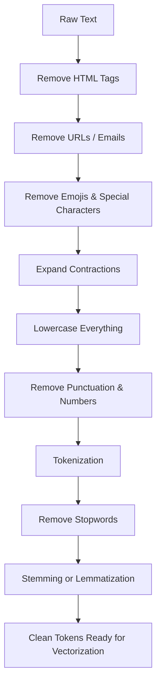

# Text Classification Using ML: Preprocessing & Sentiment Basics

## 🎯 Learning Goal

By the end of this note, you should understand:
- What text preprocessing is and why it's the first (and most important) step before any text classification
- Every common preprocessing operation — what it does, how it works, and when/why you'd actually use it
- How a trained model actually decides whether a piece of text is Positive or Negative sentiment, with worked examples

---

## 🤔 What is it?

**Text Classification** is teaching a model to read a piece of text and assign it a category — like "Positive" vs "Negative" review, "Spam" vs "Not Spam" email, or "Sports" vs "Politics" news article.

**Text Preprocessing** is the cleanup stage that happens *before* any of that classification — it takes messy, real-world text (with typos, HTML, links, random casing, punctuation) and turns it into a clean, consistent form that a model can learn patterns from.

> 🧑‍🎓 Analogy: Think of preprocessing like washing and chopping vegetables before cooking. The recipe (the ML model) can technically "run" on dirty, whole vegetables, but the dish (predictions) will be far worse. Clean, uniformly-cut ingredients (clean, consistent text) make the final result much better.

---

## ❓ Why do we need it?

- Raw text scraped from the web, social media, or reviews is **messy** — it has HTML tags, links, emojis, inconsistent capitalization, typos, and filler words.
- Models (especially older/simpler ones like Bag of Words or TF-IDF) treat "Great", "great", and "GREAT!!!" as three *completely different* tokens unless we clean the text first — this wastes model capacity and hurts accuracy.
- Preprocessing reduces noise, shrinks the vocabulary size, and helps the model focus on words that actually carry meaning for the task (e.g., sentiment-carrying words like "amazing" or "terrible").

---

## 🧠 Key Idea

- Preprocessing is a **pipeline of small cleanup steps**, applied roughly in the order: remove noise (HTML/URLs/emojis) → normalize case/punctuation → tokenize → remove low-value words (stopwords) → reduce words to base forms (stemming/lemmatization).
- Not every operation is needed for every project — you pick the operations based on your data source and your model type (e.g., Transformers need *less* aggressive cleanup than Bag of Words/TF-IDF models).
- After preprocessing, text still needs **vectorization** (One-Hot, BoW, TF-IDF, Word2Vec, Transformer embeddings — see [[02_Data_Representation_and_Vectorization]]) before a classifier can use it.
- A sentiment classifier ultimately works by learning which words push a prediction toward "Positive" and which push it toward "Negative," then combining those signals into one decision.

---

## 📚 Important Terms

| Term | Simple Meaning | Example |
|------|----------------|----------|
| Noise | Irrelevant characters/content mixed into real text | HTML tags, ads, signatures |
| Stopwords | Very common words that carry little meaning on their own | "the", "is", "and", "a" |
| Tokenization | Splitting text into individual words/units | "I love this" → ["I", "love", "this"] |
| Normalization | Making text consistent (same case, no extra spaces) | "GREAT!!" → "great" |
| Stemming | Crude chopping of a word to its root form | "running" → "run" |
| Lemmatization | Dictionary-correct reduction to base word form | "better" → "good" |
| Contraction Expansion | Turning shortened words into full form | "don't" → "do not" |
| Corpus Vocabulary Size | Total number of unique words a model has to learn about | Smaller after cleanup = easier to learn |
| Sentiment Score | A numeric value showing how positive/negative a prediction leans | +2.1 = strongly positive |

---

## 🔄 How it Works — The Full Preprocessing Pipeline



Step-by-step, with **how** it works, **why** you'd use it, and a **real use case**:

### 1. Removing HTML Tags
**How:** Strip out anything between `<` and `>` (e.g., using regex or a library like BeautifulSoup).
**Why:** Text scraped from websites often carries leftover markup like `<p>`, `<br>`, `<div>` that adds zero meaning.
**Use case:** Scraping product reviews from an e-commerce page — the raw HTML often looks like `<p>This phone is <b>amazing</b>!</p>`, and you only want *"This phone is amazing!"*

### 2. Removing URLs / Email Addresses
**How:** Regex patterns matching `http://...`, `www...`, or `[email protected]` formats, replacing them with nothing (or a placeholder like `<URL>`).
**Why:** Links and emails are almost never useful for classification and just add noise/unique tokens the model will never see again.
**Use case:** Cleaning tweets or support emails before spam detection — a tweet like "Check this out: http://spam-link.com" shouldn't have that URL treated as a meaningful "word."

### 3. Removing Emojis & Special Characters
**How:** Strip out non-alphanumeric symbols and emoji Unicode ranges (or in some sentiment tasks, *convert* emojis to words like 😀 → "happy" instead of deleting them).
**Why:** Depending on the model, emojis can either be noise (simple BoW models can't use them well) or a signal (in sentiment tasks, they're often converted rather than deleted).
**Use case:** Analyzing customer chat messages — "Great service!!! 😍🔥" might become "Great service happy fire" if emojis are converted, preserving sentiment signal.

### 4. Expanding Contractions
**How:** Use a lookup dictionary to replace contractions with full forms: "don't" → "do not", "it's" → "it is".
**Why:** Without this, "don't" might get split weirdly during tokenization, or treated as a completely separate token from "do" and "not" — losing the negation signal.
**Use case:** Sentiment analysis where negation matters a lot — "I don't like this" needs "not" to be clearly present so a model can catch the negative flip (see the negation problem discussed later).

### 5. Lowercasing
**How:** Convert every character to lowercase.
**Why:** Without this, "Great", "great", and "GREAT" are treated as three unrelated words, splitting your data and diluting the signal.
**Use case:** Almost every text classification task uses this — it's one of the most universally applied steps, except for tasks where case matters (like sarcasm/emphasis detection, where "GREAT" in all-caps might actually be a meaningful signal to preserve!).

### 6. Removing Punctuation & Numbers
**How:** Strip out characters like `!`, `?`, `,`, `.` and digits (or convert numbers into a placeholder token like `<NUM>`).
**Why:** Punctuation and raw numbers usually don't help a simple BoW/TF-IDF model, and they inflate the vocabulary unnecessarily (e.g., "great!" and "great" becoming different tokens).
**Use case:** Preparing product reviews for a Bag of Words model — "Rated 5/5, amazing!!!" becomes "rated amazing" after cleanup for a simpler, cleaner vocabulary.

### 7. Tokenization
**How:** Split the cleaned string into individual units — usually words, sometimes sentences.
**Why:** Every downstream step (stopword removal, stemming, vectorization) operates on individual tokens, not the whole raw string.
**Use case:** "the movie was great" → `["the", "movie", "was", "great"]` — this list is what actually gets fed into stopword removal and vectorization.

### 8. Removing Stopwords
**How:** Filter out words from a predefined "stopword list" (the, is, at, on, and, a, an, etc.).
**Why:** These words appear in almost every sentence, so they add bulk to your vocabulary without helping the model tell categories apart.
**Use case:** Classic Bag of Words / TF-IDF spam detection — removing "the", "is", "a" shrinks the vocabulary and lets the model focus on distinctive words like "free", "winner", "urgent". *(Caveat: for sentiment analysis, be careful — words like "not" and "no" are sometimes in stopword lists, but removing them destroys negation meaning!)*

### 9. Stemming or Lemmatization
**How:** Reduce each word to a root/base form — stemming chops crudely (rule-based), lemmatization looks up the correct dictionary form.
**Why:** Groups together variants of the same word ("running", "runs", "ran" → "run") so the model doesn't treat them as unrelated, boosting the signal per word.
**Use case:** A review classifier sees "loved", "loving", "loves" all reduce to "love" — so all three contribute to learning that "love" is a strong positive-sentiment word, instead of splitting that signal across three separate tokens.

---

## 🌍 Real-Life Example

Think of a **restaurant health inspector sorting complaint letters** into "Serious" vs "Minor" issues:
- First, they'd ignore letterhead/logos and signatures (like removing HTML tags/URLs).
- They'd mentally correct sloppy handwriting into standard words (like normalization/lowercasing).
- They'd skip filler phrases like "Dear Sir/Madam" and "Thank you for your time" (like removing stopwords) since those don't indicate severity.
- They'd group "rats," "rat," and "rodent" together mentally as the same core issue (like stemming/lemmatization) before deciding how serious the letter is.

---

## 💻 Technical Example

**Raw text:**
```
"OMG!!! This phone is soooo AMAZING 😍 I don't regret buying it at all!! check it out: http://shop.example.com <br>"
```

**Step-by-step cleanup in Python:**

```python
import re

text = "OMG!!! This phone is soooo AMAZING 😍 I don't regret buying it at all!! check it out: http://shop.example.com <br>"

# 1. Remove HTML tags
text = re.sub(r'<.*?>', '', text)

# 2. Remove URLs
text = re.sub(r'http\S+|www\S+', '', text)

# 3. Remove emojis (simplified pattern)
text = re.sub(r'[^\x00-\x7F]+', '', text)

# 4. Expand contractions (simplified example)
text = text.replace("don't", "do not")

# 5. Lowercase
text = text.lower()

# 6. Remove punctuation
text = re.sub(r'[^\w\s]', '', text)

print(text)
# "omg this phone is soooo amazing i do not regret buying it at all check it out "
```

**7-9. Tokenize → remove stopwords → lemmatize:**

```python
tokens = text.split()
# ['omg', 'this', 'phone', 'is', 'soooo', 'amazing', 'i', 'do', 'not',
#  'regret', 'buying', 'it', 'at', 'all', 'check', 'it', 'out']

stopwords = {'this', 'is', 'i', 'do', 'it', 'at', 'all', 'out'}
tokens = [t for t in tokens if t not in stopwords]
# ['omg', 'phone', 'soooo', 'amazing', 'not', 'regret', 'buying', 'check']

# Lemmatize "buying" -> "buy"
tokens = [t if t != 'buying' else 'buy' for t in tokens]
# ['omg', 'phone', 'soooo', 'amazing', 'not', 'regret', 'buy', 'check']
```

Notice we deliberately **kept "not"** out of the stopword list here — removing it would have destroyed the negation signal in "not regret," which is actually a *positive* phrase ("I do not regret" = "I'm glad").

---

## 🖼 Visual Representation

```
Raw Text
   │
   ▼
Remove HTML/URLs/Emojis  ──────►  Noise gone
   │
   ▼
Expand Contractions  ───────────►  "don't" → "do not"
   │
   ▼
Lowercase + Remove Punctuation ─►  Consistent casing, no clutter
   │
   ▼
Tokenization  ───────────────────►  ["do", "not", "regret", "buying"]
   │
   ▼
Remove Stopwords (carefully!) ──►  Keep meaning-bearing + negation words
   │
   ▼
Stemming / Lemmatization  ──────►  "buying" → "buy"
   │
   ▼
Clean Tokens → Vectorization → Classifier → Positive / Negative
```

---

## ⚖ Comparison

| Preprocessing Step | Helps Bag of Words / TF-IDF | Helps Transformers |
|----------------------|------------------------------|------------------------|
| Remove HTML/URLs | ✅ Yes, reduces noise | ✅ Yes |
| Lowercasing | ✅ Yes, shrinks vocabulary | ⚠ Often unnecessary — Transformers handle case well |
| Remove Stopwords | ✅ Yes, focuses on signal words | ❌ Usually skipped — Transformers use stopwords for context/grammar |
| Stemming/Lemmatization | ✅ Yes, groups word variants | ❌ Usually skipped — Transformers already understand word variants via subword tokens |
| Expand Contractions | ✅ Helpful | ⚠ Optional — modern tokenizers often handle contractions fine |

> This is a big, often-missed point: **older models (BoW/TF-IDF) need heavy preprocessing; modern Transformer-based models need much lighter preprocessing**, because they learn context and word relationships directly from raw(ish) text.

---

## 💡 Easy Trick to Remember

> 📌 **Preprocessing = "Wash, Chop, Sort" before cooking.** Wash (remove HTML/URLs/emojis), Chop (tokenize), Sort (remove stopwords, group similar words via stemming/lemmatization).

> 📌 Remember the danger word: **"NOT"** — never blindly remove negation words as stopwords, or you'll flip your sentiment signal backwards without realizing it.

---

## ⚠ Common Misconceptions

❌ You should always apply every preprocessing step to every project.
✅ The right steps depend on your data source and model — Transformers need far less aggressive cleanup than Bag of Words/TF-IDF.

❌ Removing stopwords always helps.
✅ Removing words like "not," "no," and "never" as stopwords can destroy negation meaning and hurt sentiment analysis specifically.

❌ Stemming and Lemmatization are the same thing.
✅ Stemming is a fast, crude chop; Lemmatization is a slower, dictionary-correct reduction — they can produce different results ("was" → stemming: "wa" (wrong!) vs lemmatization: "be" (correct)).

❌ More preprocessing always means better model accuracy.
✅ Over-cleaning (e.g., removing all punctuation/case for a Transformer model) can actually strip away useful context and hurt performance.

---

## 🔍 Interview Questions

- Why is text preprocessing necessary before feeding text into a Bag of Words or TF-IDF model?
- Name five common text preprocessing operations and explain what each does.
- Why can removing stopwords sometimes hurt a sentiment analysis model?
- What's the difference between stemming and lemmatization, and when would you choose one over the other?
- Why do Transformer-based models generally need less preprocessing than Bag of Words models?
- How would you handle emojis in a sentiment analysis pipeline — remove or convert them? Why?
- How does a sentiment model turn cleaned text into a "Positive" or "Negative" label?

---

## 📝 Quick Revision

- Text preprocessing cleans messy raw text into a consistent form before vectorization and classification.
- Common steps (roughly in order): remove HTML/URLs/emojis → expand contractions → lowercase → remove punctuation/numbers → tokenize → remove stopwords → stem/lemmatize.
- Each step exists to reduce noise and vocabulary size so the model can focus on meaning-bearing words.
- Stopword removal and stemming/lemmatization mainly benefit older models (BoW, TF-IDF) — Transformers need lighter preprocessing since they understand context directly.
- Be careful with negation words ("not," "no," "never") — removing them as stopwords can flip sentiment meaning.
- After preprocessing, text still needs vectorization (BoW, TF-IDF, Word2Vec, Transformer embeddings) before a classifier can use it.
- A sentiment classifier works by learning a weight per word, summing weighted evidence, and outputting Positive/Negative based on the total score.
- Preprocessing choices should match your data source (web-scraped vs clean survey text) and your model type.

---

## 🎓 Cheat Sheet

| Step | One-Line Purpose |
|------|--------------------|
| Remove HTML Tags | Strip website markup noise |
| Remove URLs/Emails | Strip non-meaningful links/addresses |
| Handle Emojis | Remove or convert to sentiment-carrying words |
| Expand Contractions | Preserve negation and full word meaning |
| Lowercase | Normalize casing so "Great"="great" |
| Remove Punctuation/Numbers | Shrink vocabulary, cut noise |
| Tokenization | Split text into individual word units |
| Remove Stopwords | Cut low-value common words (carefully, keep negations) |
| Stemming/Lemmatization | Group word variants into one base form |

---

## 📖 Related Topics

**Data Representation & Vectorization** — after preprocessing, cleaned tokens still need to become numbers (One-Hot, Bag of Words, TF-IDF, Word2Vec, Transformer embeddings) before any classifier can use them. See [[02_Data_Representation_and_Vectorization]] for the full breakdown, including a detailed walkthrough of how a sentiment model turns word vectors into a Positive/Negative decision using learned word weights.

**Negation Handling** — a deeper NLP challenge where simple models fail on phrases like "not great" or "not bad" because they don't understand how "not" flips meaning; Transformers handle this far better via attention.

**Text Normalization Beyond Basics** — spelling correction, chat-word/slang expansion ("u" → "you", "gr8" → "great"), and accented-character handling (café → cafe) for even messier real-world data like social media posts.

---

## ✅ Key Takeaways

1. Text preprocessing turns messy raw text into a clean, consistent form before any model can learn from it.
2. Each preprocessing step (HTML removal, lowercasing, stopword removal, stemming/lemmatization, etc.) has a specific purpose: cutting noise or reducing vocabulary size.
3. Older models (Bag of Words, TF-IDF) need heavy preprocessing; modern Transformer-based models need much lighter cleanup since they understand context directly.
4. Never blindly remove negation words ("not," "no," "never") as stopwords — doing so can completely flip the intended sentiment.
5. After cleanup, text still needs vectorization before a classifier can turn it into a Positive/Negative (or other category) prediction.
