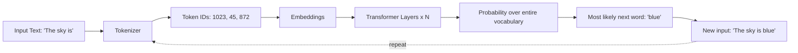
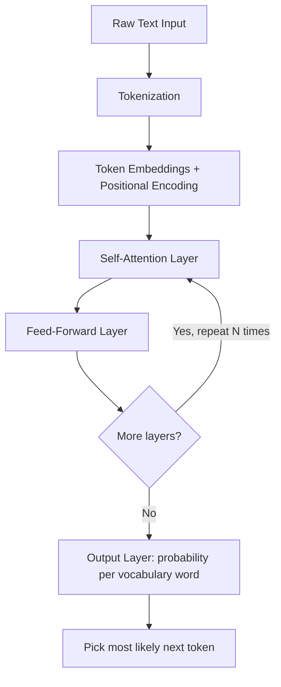
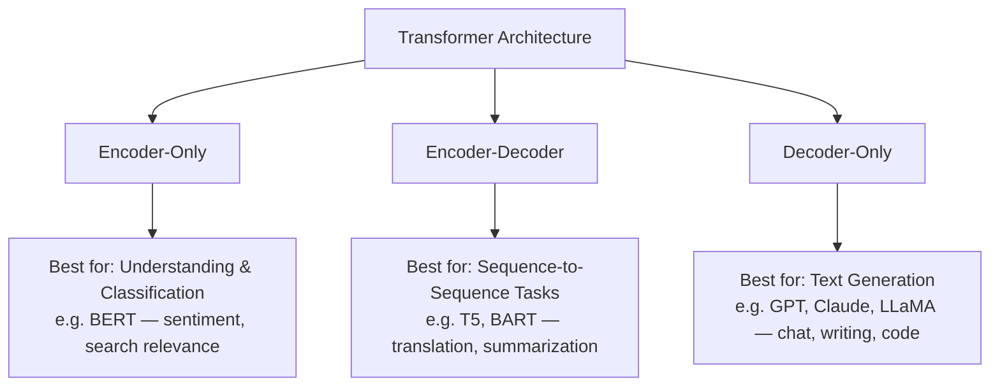
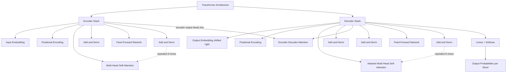
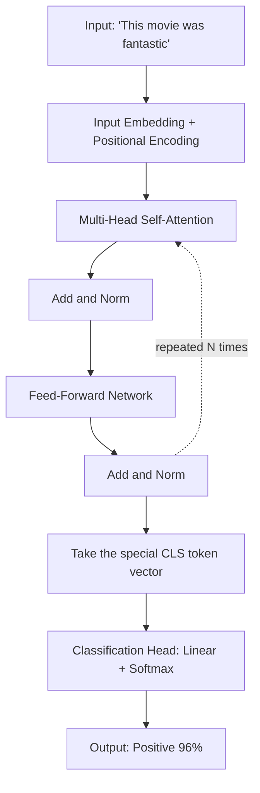
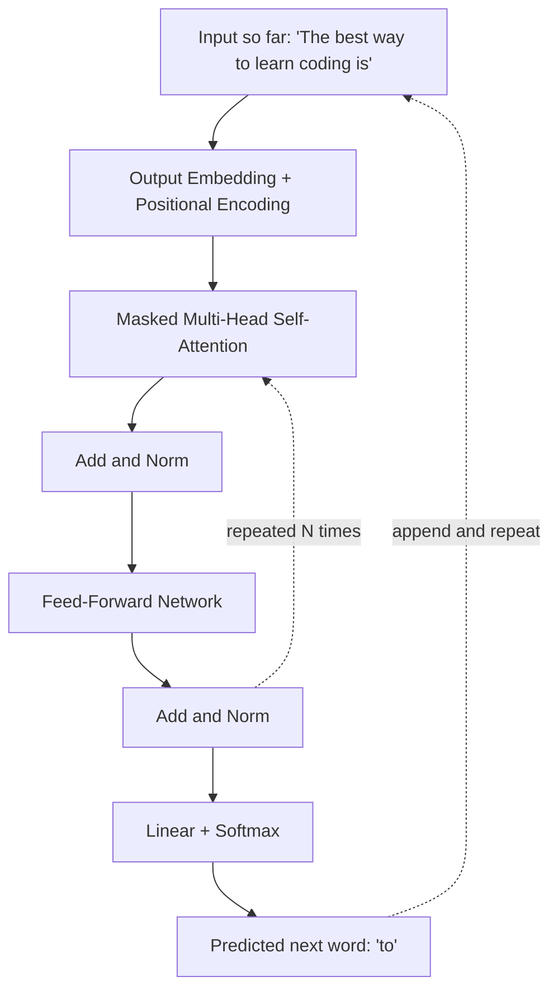
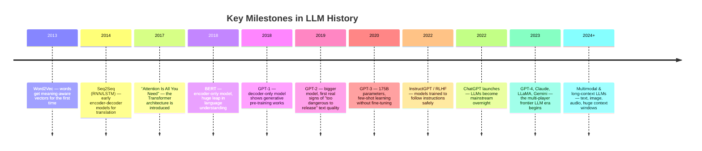
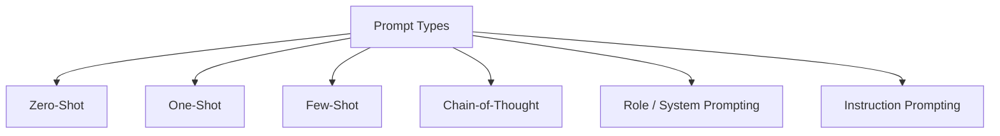

# Large Language Models (LLMs)

## 🎯 Learning Goal

By the end of this note, you should understand:
- What an LLM actually is, with a graphical view of how it works
- Why it's called "Large" Language Model — what exactly is large about it
- Famous real-world LLMs and what each is typically used for
- The core Transformer architecture inside an LLM, and the different architecture "flavors" (encoder-only, decoder-only, encoder-decoder)

---

## 🤔 What is it?

A **Large Language Model (LLM)** is a deep learning model trained on massive amounts of text to predict the next word (or token) in a sequence. By getting extremely good at this one simple task — "what word comes next?" — it ends up learning grammar, facts, reasoning patterns, and even coding ability, purely as a side effect.

> 🧑‍🎓 Analogy: Think of an LLM as an extremely well-read autocomplete. Like the autocomplete on your phone that guesses your next word, but instead of learning from your last few texts, it has read a huge chunk of the internet — so its guesses are far more fluent, informed, and context-aware.

**Graphical view — the core loop of an LLM:**



This loop — predict one word, append it, predict the next word, repeat — is literally how an LLM generates whole sentences, paragraphs, and even code, one token at a time.

---

## ❓ Why do we need it?

- Before LLMs, NLP needed a **separate model for every task** — one model for translation, another for summarization, another for sentiment. This was expensive and didn't generalize.
- LLMs learn general-purpose language understanding once, then can be **reused or lightly adapted** for many tasks: chatbots, summarizers, coders, translators, tutors — all from roughly the same underlying model.
- They can handle **open-ended, unseen instructions** ("write me a poem about the ocean in the style of a pirate") that a task-specific model could never have been explicitly trained for.

---

## 🧠 Key Idea

- LLMs are trained on one core objective: **predict the next token**, given everything that came before it.
- The "Large" in LLM refers to three things being large *simultaneously*: the number of **parameters** (learned weights, often billions), the size of the **training data** (trillions of words/tokens), and the amount of **compute** used to train it.
- Under the hood, almost every modern LLM is built from the **Transformer architecture**, which uses a mechanism called **self-attention** to understand how every word in a sentence relates to every other word.
- There are three broad architecture "flavors": **encoder-only** (best at understanding/classifying text), **decoder-only** (best at generating text), and **encoder-decoder** (best at transforming one sequence into another, like translation).
- One trained LLM can perform a huge range of tasks (chat, code, summarize, translate) without being retrained for each one — this is what makes them so powerful and general-purpose.

---

## 📚 Important Terms

| Term | Simple Meaning | Example |
|------|----------------|----------|
| Parameter | A single learned number (weight) inside the model | GPT-3 has ~175 billion parameters |
| Token | The smallest chunk of text the model reads (word or sub-word) | "unbelievable" → "un", "believ", "able" |
| Self-Attention | Mechanism letting the model weigh how relevant every other word is, for each word | Lets "it" correctly refer back to "the dog" in a sentence |
| Transformer | The neural network architecture almost all modern LLMs are built on | Powers GPT, Claude, BERT, Gemini |
| Pre-training | The initial, expensive phase of training on huge general text data | Learning grammar/facts from a huge chunk of the internet |
| Fine-tuning | A smaller, focused extra training phase on specific data/task | Turning a general LLM into a customer-support-only assistant |
| Encoder | The part of a Transformer that reads/understands input text | Used in BERT for classification tasks |
| Decoder | The part of a Transformer that generates output text, one token at a time | Used in GPT for text generation |
| Autoregressive | Generating output one token at a time, each depending on previous tokens | GPT writing a sentence word-by-word |
| Context Window | The maximum number of tokens the model can consider at once | "This model supports up to 200K tokens" |

---

## 🔄 How it Works



Step-by-step in simple language:

1. **Tokenization** — the input sentence is broken into tokens (words/sub-words), and each token is converted into a number (token ID).
2. **Embeddings + Positional Encoding** — each token ID becomes a vector (see [[02_Data_Representation_and_Vectorization]] for what embeddings are), and a "positional encoding" is added so the model knows the *order* of words, since attention alone doesn't track position.
3. **Self-Attention** — for every token, the model calculates how much attention to pay to every other token in the input, letting it understand context (e.g., which noun a pronoun refers to).
4. **Feed-Forward Layer** — each token's representation is further transformed through a small neural network, refining what the model "understands" about it.
5. **Repeat N times** — real LLMs stack this attention + feed-forward block dozens of times (e.g., 32, 96 layers), each layer refining the understanding further.
6. **Output Layer** — the final layer converts the last token's representation into a probability distribution over the entire vocabulary — "how likely is each possible word to come next?"
7. **Pick the next token** — the highest-probability (or sampled) token gets chosen, added to the sequence, and the whole process repeats to generate the next word.

---

## 🌍 Real-Life Example

Think of a **highly experienced ghostwriter**:
- They've read thousands of books, articles, and letters (pre-training on huge text data).
- Given the start of any sentence, they can very fluently guess how it should continue, because they've absorbed so many patterns of how language works (next-token prediction).
- If you brief them for a specific client's tone (fine-tuning), they adapt their general writing skill to that narrower, specific style — without forgetting everything else they know.

---

## 💻 Technical Example

**Why "Large" Language Model — a concrete size comparison:**

| Model | Approx. Parameters | Approx. Training Data |
|-------|----------------------|---------------------------|
| A small classic NLP model (e.g., a basic BoW/TF-IDF classifier) | Thousands to a few million | A few thousand documents |
| BERT-base (2018) | ~110 million | ~3.3 billion words (Wikipedia + BookCorpus) |
| GPT-3 (2020) | ~175 billion | ~300+ billion tokens |
| Modern frontier LLMs (e.g., GPT-4-class, Claude-class) | Estimated in the hundreds of billions to trillions | Trillions of tokens |

This jump — from millions of parameters and thousands of documents, to hundreds of billions of parameters and trillions of tokens — is exactly why the field started calling these models "Large" Language Models: everything about them (weights, data, compute, cost) scaled up by multiple orders of magnitude compared to earlier NLP models.

**Famous LLMs and their typical use cases:**

| LLM | Made By | Typical Use Case |
|-----|----------|---------------------|
| GPT (GPT-4, GPT-5 family) | OpenAI | General assistant, chat, content generation, coding |
| Claude | Anthropic | Coding, reasoning, long-document analysis, safe/aligned assistant tasks |
| Gemini | Google DeepMind | Multimodal assistant (text, image, video understanding) |
| LLaMA | Meta | Open-weight model for research and custom fine-tuning |
| BERT | Small only | Text classification, search relevance, understanding-only tasks (not generation) |
| T5 | Google | Text-to-text tasks: translation, summarization, question answering |

**A Closer Look — OpenAI's LLM Model Lineup (Examples & Short Notes)**

Since GPT is one of the most well-known LLM families, it's worth seeing how it evolved model-by-model:

| Model | Year | Short Note |
|-------|------|--------------|
| GPT-1 | 2018 | The very first version — proved that pre-training a decoder-only Transformer on next-token prediction, then fine-tuning, could beat task-specific models. Small by today's standards (~117M parameters). |
| GPT-2 | 2019 | A much bigger scale-up. Text was fluent enough that OpenAI initially withheld the full model, worried about misuse (fake news, spam) — an early sign of how powerful scaling language models could get. |
| GPT-3 | 2020 | Jumped to ~175 billion parameters. Introduced "few-shot learning" — give it a couple of examples in the prompt, and it could do a brand-new task without any retraining. |
| GPT-3.5 | 2022 | Refined version of GPT-3, fine-tuned with human feedback (RLHF) for instruction-following. This is the model that powered the original ChatGPT launch and made LLMs mainstream. |
| GPT-4 | 2023 | Major reasoning and accuracy improvement over GPT-3.5; also added multimodal input (could understand images, not just text). Became the backbone for many production AI products. |
| GPT-4o ("omni") | 2024 | Natively multimodal — designed from the ground up for text, image, and audio together, with faster, cheaper responses than GPT-4. |
| o1 / o3 (reasoning models) | 2024–2025 | A different family focused on "thinking longer" before answering — better at multi-step math, coding, and logic problems by spending extra internal reasoning steps before responding. |
| GPT-5 family | 2025 | OpenAI's newer flagship generation, aimed at unifying strong general chat ability with the deeper reasoning strengths introduced by the o1/o3 line. |

> 💡 Notice the two different "directions" of progress here: **GPT-1 → GPT-2 → GPT-3 → GPT-4** mostly scaled up size and general capability, while the **o1/o3** line branched off to focus specifically on *reasoning quality* rather than just raw scale — showing that "bigger" isn't the only way to make an LLM better.

**Open-Source vs. Commercial (Closed) LLMs — Examples & Short Notes**

Every LLM falls roughly into one of two camps based on whether you can download and run the model's weights yourself, or only access it through a paid API/product:

| Type | Example Models | Short Note |
|------|-------------------|--------------|
| Open-Source / Open-Weight | LLaMA (Meta) | Weights are downloadable and freely usable (with a license); popular base for research and custom fine-tuning. |
| Open-Source / Open-Weight | Mistral & Mixtral (Mistral AI) | Smaller, efficient open models; Mixtral uses a "mixture of experts" design to stay fast while still powerful. |
| Open-Source / Open-Weight | Gemma (Google) | Google's smaller, open-weight sibling to the closed Gemini family — meant for local/self-hosted use. |
| Open-Source / Open-Weight | DeepSeek (DeepSeek AI) | Open-weight models competitive with closed frontier models, notably strong at coding/reasoning for their cost. |
| Open-Source / Open-Weight | Qwen (Alibaba) | Open-weight family widely used for multilingual tasks and fine-tuning. |
| Commercial / Closed | GPT-4, GPT-4o, GPT-5 (OpenAI) | Accessible only via API/ChatGPT; weights are not released publicly. |
| Commercial / Closed | Claude (Anthropic) | Accessible via API/Claude apps; strong focus on safety-aligned, closed-weight deployment. |
| Commercial / Closed | Gemini (Google DeepMind) | Google's flagship closed model, accessible via API/Gemini app (distinct from the open Gemma line). |

**Key Differences at a Glance:**

| Aspect | Open-Source / Open-Weight | Commercial / Closed |
|--------|------------------------------|--------------------------|
| Access to weights | ✅ Downloadable, can self-host | ❌ Only available via API/app |
| Cost | Free to download; you pay only for your own compute | Pay-per-use API pricing or subscription |
| Customization | Can be fully fine-tuned or modified for your own data | Limited to prompt engineering or provider-offered fine-tuning |
| Data Privacy | Data can stay fully on your own servers | Data typically passes through the provider's servers |
| Performance (frontier-level) | Often close to, but usually a step behind, the top closed models | Usually leads on the hardest reasoning/coding benchmarks |
| Transparency | Architecture/training details often more openly documented | Training data/methods often kept confidential |
| Maintenance Burden | You handle hosting, scaling, updates yourself | Provider handles all infrastructure and updates |

> 💡 Simple way to remember it: **Open-source = you own the engine, you do the maintenance. Commercial = you rent a ride, someone else handles the engine.** Choose open-source when privacy/control/cost-at-scale matter most; choose commercial when you want the strongest out-of-the-box performance with zero infrastructure work.

---

## 🖼 Visual Representation

**Chart: LLM Core Architecture Types**



**Simple diagram of what happens inside one Transformer layer:**

```
        Input tokens (as vectors)
                 │
                 ▼
        ┌─────────────────┐
        │  Self-Attention  │ ← each token looks at every other token
        └─────────────────┘
                 │
                 ▼
        ┌─────────────────┐
        │  Feed-Forward    │ ← refines each token's understanding
        │     Network      │
        └─────────────────┘
                 │
                 ▼
         Output tokens (as vectors)
        (fed into the NEXT layer, repeated N times)
```

**Transformer Tree Chart — Full Component Breakdown**

This tree breaks the entire Transformer architecture down into its actual building blocks (the same blocks from the original "Attention Is All You Need" paper), showing which parts belong to the Encoder side vs. the Decoder side:



**What each branch actually does:**

| Branch | Component | Job |
|--------|-----------|------|
| Encoder | Input Embedding + Positional Encoding | Turn input words into vectors, and add order information |
| Encoder | Multi-Head Self-Attention | Let every input word look at every other input word to build context |
| Encoder | Feed-Forward Network | Refine each word's representation further |
| Decoder | Output Embedding (shifted right) | Feed in the words generated *so far* as the starting point for the next prediction |
| Decoder | Masked Self-Attention | Let the decoder attend only to *earlier* output words, never "peek" at future ones |
| Decoder | Encoder-Decoder Attention | Let the decoder look back at the encoder's understanding of the input sentence |
| Decoder | Feed-Forward + Linear + Softmax | Refine, then convert into a probability for every possible next word |

A key point students often miss: **not every model uses both stacks.** Depending on the task, a Transformer-based model may use only the Encoder branch, only the Decoder branch, or both together. Here's what each looks like in practice:

### 🌳 Encoder-Only Example (e.g., BERT) — Sentiment Classification



**Walkthrough:** The sentence *"This movie was fantastic"* goes through the Encoder stack only — there's no Decoder at all. Because self-attention here is **bidirectional** (every word can see every other word, both before and after it), the model builds a full, two-directional understanding of the sentence in one pass. A special `[CLS]` token's final vector is used as a summary of the whole sentence, and a simple classification head turns that vector into a label: **Positive (96% confidence)**. Notice this model **never generates any new text** — it only produces one decision (or per-word labels, for tasks like tagging names/places).

### 🌳 Decoder-Only Example (e.g., GPT) — Text Generation



**Walkthrough:** Notice this tree has **no Encoder branch and no Encoder-Decoder Attention block at all** — that's the defining feature of a true decoder-only model like GPT. Self-attention here is **masked** (one-directional): each word can only look at the words *before* it, never ahead, since future words don't exist yet during generation. Given *"The best way to learn coding is"*, the model predicts **"to"**, appends it, then predicts **"practice"** from the extended sentence, then **"daily"**, and so on — one token at a time, purely autoregressive, with no separate "source sentence" ever involved.

### 🌳 Both — Encoder + Decoder Example (e.g., the original Transformer / T5) — Translation

**Worked Example — Translating "I love AI" → "J'aime l'IA" (English → French):**

1. **Encoder side:** The English sentence *"I love AI"* is tokenized, embedded, and passed through the Encoder stack. Self-attention lets "love" pay attention to both "I" and "AI," building a rich contextual understanding of the whole English sentence. The Encoder's final output is a set of vectors representing the *fully understood* English sentence — this doesn't change for the rest of the process.
2. **Decoder side, step 1:** The Decoder starts with just a special `<start>` token. Masked self-attention has nothing else to look at yet. Encoder-Decoder Attention lets it look at the Encoder's output (the understood English sentence) to decide the first French word: it predicts **"J'aime"**.
3. **Decoder side, step 2:** Now the Decoder's input is `<start> J'aime`. Masked self-attention lets it look back at "J'aime" (but nothing ahead, since nothing ahead exists yet). Encoder-Decoder Attention again checks the English meaning, and it predicts the next word: **"l'IA"**.
4. **Decoder side, step 3:** Input is now `<start> J'aime l'IA`. The model predicts a special `<end>` token, signaling the translation is complete.
5. **Final output:** `"J'aime l'IA"` — built one token at a time, each step re-checking both what's been generated so far (masked self-attention) and the original English meaning (encoder-decoder attention).

> 💡 This worked example is exactly why encoder-decoder models like T5/the original Transformer are the natural fit for translation: the Encoder fully understands the *source* language once, while the Decoder generates the *target* language one word at a time, constantly cross-checking back against that source understanding.

**Quick Comparison — All Three Variants Side by Side**

| Variant | Stacks Used | Attention Type | Example Model | Example Task |
|---------|--------------|-------------------|--------------------|-------------------|
| Encoder-Only | Encoder only | Bidirectional self-attention | BERT | Sentiment classification, search relevance |
| Decoder-Only | Decoder only | Masked (one-directional) self-attention | GPT, Claude, LLaMA | Chat, text generation, coding |
| Both (Encoder-Decoder) | Encoder + Decoder | Bidirectional (encoder) + Masked (decoder) + Encoder-Decoder Attention | T5, original Transformer | Translation, summarization |

---

## 🕰 Key Milestones in the History of LLMs

LLMs didn't appear overnight — they're the result of a series of breakthroughs, each solving a limitation of the one before it.



| Year | Milestone | Why It Mattered |
|------|-----------|--------------------|
| 2013 | Word2Vec | First practical way to give words meaning-aware vectors (see [[02_Data_Representation_and_Vectorization]]) |
| 2014 | Seq2Seq (RNN/LSTM-based) | Enabled encoder-decoder tasks like machine translation, but struggled with long sentences |
| 2017 | Transformer ("Attention Is All You Need") | Replaced RNNs with self-attention — enabled parallel training and much better long-range understanding |
| 2018 | BERT | Proved encoder-only, bidirectional pre-training massively improves language understanding tasks |
| 2018 | GPT-1 | Showed that a decoder-only model pre-trained on next-token prediction could be fine-tuned for many tasks |
| 2019 | GPT-2 | Scaled up GPT-1; text quality was strong enough that OpenAI initially delayed full release over misuse concerns |
| 2020 | GPT-3 | Massive scale-up (175B parameters) showed "few-shot learning" — the model could do new tasks from just a few examples in the prompt, no fine-tuning needed |
| 2022 | InstructGPT / RLHF | Introduced Reinforcement Learning from Human Feedback, aligning model outputs with what humans actually want (helpful, honest, harmless) |
| 2022 | ChatGPT | Packaged an instruction-tuned LLM into an easy chat interface — brought LLMs to mainstream, everyday use |
| 2023 | GPT-4, Claude, LLaMA, Gemini | Multiple labs (OpenAI, Anthropic, Meta, Google) release competing frontier-class LLMs — the field becomes a fast-moving multi-player race |
| 2024+ | Multimodal & long-context models | Models increasingly handle text + image + audio together, and support much larger context windows (100K–1M+ tokens) |

> 💡 Notice the pattern: **Word2Vec taught words meaning → Transformers taught attention/context → BERT/GPT proved pre-training at scale works → RLHF taught models to follow instructions safely → ChatGPT made it accessible to everyone.** Each milestone solves the next bottleneck.

---

## ⚖ Comparison

| Architecture | Reads Input | Generates Output | Example Models | Best For |
|---------------|---------------|----------------------|--------------------|-----------|
| Encoder-only | ✅ Yes (bidirectional — sees full sentence at once) | ❌ No | BERT, RoBERTa | Classification, search, understanding |
| Decoder-only | ✅ Yes (one-directional — sees only prior words) | ✅ Yes | GPT, Claude, LLaMA | Chat, text generation, coding |
| Encoder-Decoder | ✅ Yes (encoder side) | ✅ Yes (decoder side) | T5, BART | Translation, summarization |

---

## 💡 Easy Trick to Remember

> 📌 **"Large" = Large Parameters + Large Data + Large Compute** — all three have to scale up together; that's the actual definition, not just "a big model."

> 📌 Remember architecture roles with **"BERT Understands, GPT Generates, T5 Transforms"** — Encoder-only (BERT) understands, Decoder-only (GPT) generates, Encoder-Decoder (T5) transforms one sequence into another.

---

## ⚠ Common Misconceptions

❌ An LLM understands language the way a human does.
✅ It predicts the statistically most likely next token based on training patterns — it has no real-world grounded understanding.

❌ Bigger models are always better for every task.
✅ A smaller, fine-tuned model can outperform a giant general LLM on a narrow, specific task, and costs far less to run.

❌ All LLMs work the same way internally.
✅ Encoder-only, decoder-only, and encoder-decoder architectures are structurally different and suited to different tasks — BERT (encoder-only) can't generate free-form text like GPT (decoder-only) can.

❌ LLMs are trained specifically to "chat."
✅ Most LLMs are pre-trained purely on next-token prediction over general text; chat behavior is added afterward through fine-tuning and alignment techniques (like RLHF).

---

## 🔍 Interview Questions

- What makes a language model "large" — is it just the number of parameters?
- What is the difference between encoder-only, decoder-only, and encoder-decoder architectures?
- Why is self-attention important in the Transformer architecture?
- What is the difference between pre-training and fine-tuning?
- Why can't BERT be used directly for free-form text generation like GPT can?
- What is a context window, and why does it matter for LLM performance?
- Name a use case where an encoder-decoder model would be preferred over a decoder-only model.
- What breakthrough did the 2017 Transformer paper introduce, and why did it replace RNN/LSTM-based models?
- What is RLHF, and why was it a critical milestone for making LLMs usable as assistants?
- Walk through what happens inside a Transformer's Encoder vs. Decoder stack when translating a sentence.
- Why does the Decoder use "masked" self-attention while the Encoder does not?
- Why does GPT (decoder-only) have no Encoder-Decoder Attention block, unlike the original Transformer or T5?
- How did OpenAI's GPT lineup evolve from GPT-1 to GPT-4, and how do the o1/o3 reasoning models differ in approach from that scaling trend?
- What is the difference between an open-source/open-weight LLM and a commercial/closed LLM? Give an example of each.
- Why might a company choose an open-weight model like LLaMA over a commercial API like GPT-4, despite potentially lower raw performance?

---

## 📝 Quick Revision

- An LLM is a deep learning model trained to predict the next token, and this simple objective produces surprisingly general language ability.
- "Large" refers to large parameter count, large training data, and large compute — all scaled up together.
- Almost all modern LLMs are built on the Transformer architecture, powered by self-attention.
- Three architecture flavors: Encoder-only (understanding, e.g. BERT), Decoder-only (generation, e.g. GPT/Claude/LLaMA), Encoder-Decoder (transformation, e.g. T5).
- The generation loop is: tokenize → embed → attend → feed-forward (×N layers) → output probabilities → pick next token → repeat.
- Famous LLMs: GPT (general assistant), Claude (reasoning/coding), Gemini (multimodal), LLaMA (open-weight research), BERT (classification/search), T5 (translation/summarization).
- Pre-training teaches general language ability; fine-tuning adapts that ability to a specific task or style.
- LLMs don't truly "understand" — they generate statistically likely continuations based on patterns learned from data.
- Key milestones: Word2Vec (2013) → Seq2Seq (2014) → Transformer (2017) → BERT/GPT-1 (2018) → GPT-2 (2019) → GPT-3 (2020) → RLHF/InstructGPT (2022) → ChatGPT (2022) → GPT-4/Claude/LLaMA/Gemini (2023) → multimodal & long-context models (2024+).
- Not every Transformer-based model uses both stacks: Encoder-only (BERT) uses bidirectional attention for classification; Decoder-only (GPT) uses masked attention and has no Encoder-Decoder Attention block at all; Encoder-Decoder (T5) uses both stacks plus cross-attention for sequence-to-sequence tasks like translation.
- Open-source/open-weight models (LLaMA, Mistral, Gemma, DeepSeek, Qwen) can be downloaded and self-hosted, offering full customization and data privacy at the cost of your own infrastructure; commercial/closed models (GPT-4/5, Claude, Gemini) are API/app-only, usually lead on frontier performance, but keep weights and training details private.

---

## 🎓 Cheat Sheet

| Concept | One-Line Meaning |
|----------|------------------|
| LLM | A deep learning model trained to predict the next token in text |
| Parameter | A single learned weight inside the model |
| Token | Smallest text unit the model processes |
| Self-Attention | Mechanism for weighing relevance between all words in a sequence |
| Transformer | The architecture underlying nearly all modern LLMs |
| Encoder-only | Understands/classifies text (e.g., BERT) |
| Decoder-only | Generates text (e.g., GPT, Claude) |
| Encoder-Decoder | Transforms one sequence into another (e.g., T5) |
| Pre-training | Initial large-scale general training phase |
| Fine-tuning | Later, focused training on specific data/task |
| Context Window | Max tokens the model can consider at once |

---

## 📖 Related Topics

**Data Representation & Vectorization** — LLMs rely on embeddings to turn tokens into numeric vectors before attention can process them; see [[02_Data_Representation_and_Vectorization]] for the full breakdown of embeddings, Word2Vec, and why Transformers produce context-aware vectors.

**Text Classification & Preprocessing** — encoder-only LLMs like BERT are commonly used for classification tasks; see [[03_Text_Classification_and_Preprocessing]] for how raw text gets cleaned before any model (LLM included) processes it.

**Prompt Engineering** — since an LLM generates based on patterns in its input, how you phrase a prompt directly shapes its output quality; briefly covered in [[02_Data_Representation_and_Vectorization]]'s Related Topics section.

**Fine-tuning vs RAG** — two different ways to make a general LLM better at a specific task: fine-tuning changes the model's weights, while RAG (Retrieval-Augmented Generation) feeds it relevant external documents at request time without changing the model itself.

---

## ✅ Key Takeaways

1. An LLM is trained to predict the next token, and general language ability emerges as a side effect of getting really good at that one task.
2. "Large" means large parameters + large training data + large compute, scaled up together — not just a vague "big model" label.
3. Nearly every modern LLM is built on the Transformer architecture, powered by self-attention.
4. There are three architecture flavors: encoder-only (understand), decoder-only (generate), encoder-decoder (transform) — each suited to different tasks.
5. Famous LLMs (GPT, Claude, Gemini, LLaMA, BERT, T5) each lean into a different architecture and use case, from chat assistants to translation to classification.

---

## 🧩 Prompt Designing (Prompt Engineering) — Types & Examples

**What is a Prompt?**

A **prompt** is simply the input text/instructions you give an LLM to get a response back. Since an LLM works by predicting the most likely next token based on patterns it learned during training, the *exact wording* of your prompt directly decides which patterns it leans on — which is why two people can ask "the same question" worded differently and get very different quality answers.

> 🧑‍🎓 Analogy: A prompt is like the brief you give a freelancer. A vague brief ("make me a logo") gets a vague result. A clear, structured brief ("make me a minimalist black-and-white logo for a coffee shop, using a coffee cup icon") gets a far more useful result — same freelancer, same skill, just better instructions.

### Types of Prompting



**1. Zero-Shot Prompting**
**What it is:** You give the model an instruction with **no examples at all**, relying purely on what it already learned during training.
**Example:** *"Translate this sentence to French: 'I am happy.'"* → the model responds *"Je suis heureux."* without ever being shown a translation example in the prompt.
**Real-life analogy:** Asking a well-read new employee to draft a client email with zero sample emails to reference — you trust their general knowledge and training to get it right.

**2. One-Shot Prompting**
**What it is:** You give the model **exactly one worked example**, then ask it to do the same task on new input.
**Example:**
```
Q: Translate "Good morning" to French.
A: Bonjour

Q: Translate "Good night" to French.
A:
```
The model sees the one example pattern and completes it: *"Bonne nuit."*
**Real-life analogy:** Showing a new employee exactly one completed sample report, then asking them to write the next one in the same style.

**3. Few-Shot Prompting**
**What it is:** You give the model **several examples** (typically 2–5) before the real task, to firmly establish the pattern you want.
**Example:**
```
Review: "This phone is amazing!" → Positive
Review: "Terrible battery life." → Negative
Review: "Works okay, nothing special." → Neutral
Review: "Best purchase I've made this year!" → 
```
The model, having seen 3 labeled examples, correctly predicts: **Positive**.
**Real-life analogy:** Training a new customer support agent by walking them through 3–5 sample tickets and how they were resolved, before letting them handle new tickets solo.

**4. Chain-of-Thought (CoT) Prompting**
**What it is:** You explicitly ask the model to **reason step-by-step** before giving a final answer, instead of jumping straight to a conclusion. This is especially useful for math, logic, and multi-step problems.
**Example:** *"A store had 23 apples. They sold 8 and then received a new delivery of 15. How many apples do they have now? Let's think step by step."* → the model writes out: *"Start with 23. Subtract 8 sold: 23 − 8 = 15. Add 15 delivered: 15 + 15 = 30. Answer: 30 apples."* instead of just guessing a number.
**Real-life analogy:** Asking a student to "show their work" on a math test instead of just writing the final number — showing the steps makes mistakes easier to catch and the final answer more reliable.

**5. Role-Based / System Prompting**
**What it is:** You assign the model a **persona or role** to shape its tone, expertise level, and behavior for the rest of the conversation.
**Example:** *"You are a senior security engineer. Review this code for vulnerabilities and explain any risks in plain English."* → the model responds with a security-focused lens rather than a generic code review.
**Real-life analogy:** Telling an actor which character to play before a scene — same actor, but their tone, vocabulary, and focus shift completely based on the assigned role.

**6. Instruction Prompting**
**What it is:** You give **explicit, specific instructions** about the format, length, or constraints of the output, rather than a vague open-ended ask.
**Example:** *"Summarize this article in exactly 3 bullet points, each under 15 words, written for a 10-year-old."* → produces a tightly-scoped, predictable output instead of a generic summary.
**Real-life analogy:** Giving someone a precise checklist ("3 bullet points, under 15 words each") instead of a vague request ("summarize this") — the more specific the ask, the more consistent and useful the result.

### Comparison Table — All Prompt Types at a Glance

| Type | Examples Given? | Best For | Real-Life Analogy |
|------|--------------------|-----------|------------------------|
| Zero-Shot | None | Simple, well-known tasks | New hire relying on general knowledge |
| One-Shot | 1 | Establishing a simple pattern quickly | Showing one sample report to copy |
| Few-Shot | 2–5+ | Tasks needing a clear pattern (classification, formatting) | Training an agent with a handful of sample tickets |
| Chain-of-Thought | Optional | Math, logic, multi-step reasoning | Asking a student to show their work |
| Role-Based / System | None (sets persona instead) | Controlling tone/expertise/focus | Directing an actor's character |
| Instruction Prompting | None (sets format instead) | Getting precise, consistent output format | Giving a specific checklist instead of a vague ask |

> 💡 These types aren't mutually exclusive — real-world prompts often **combine** them. For example: *"You are a senior data analyst [role-based]. Here are two example summaries [few-shot]. Think step by step before answering [chain-of-thought], and respond in exactly 3 bullet points [instruction prompting]."*

---
