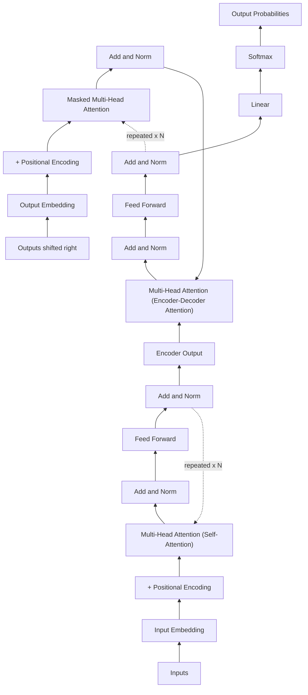
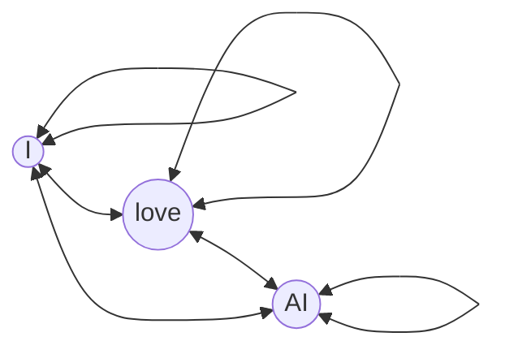
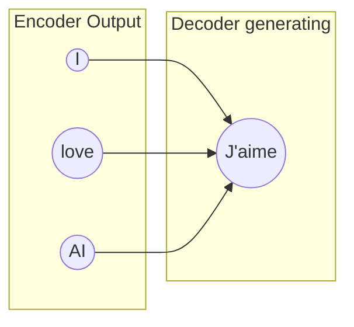
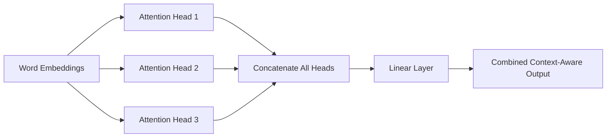

# Transformers In Depth

## 🎯 Learning Goal

By the end of this note, you should understand:
- The original Transformer architecture diagram, exactly as designed by the Google Brain team
- Why this architecture was invented, and what problem it solved that older models (RNNs/LSTMs) couldn't
- Every block in the diagram in depth: embeddings, positional encoding, multi-head self-attention (with the actual math), Add & Norm, feed-forward layers
- How Encoder and Decoder stacks connect together to produce an output

---

## 🤔 What is it?

The **Transformer** is a neural network architecture introduced in the 2017 paper **"Attention Is All You Need"**, written by a team of researchers at **Google Brain and Google Research** (Ashish Vaswani, Noam Shazeer, Niki Parmar, Jakob Uszkoreit, Llion Jones, Aidan Gomez, Łukasz Kaiser, and Illia Polosukhin). It's the architecture that almost every modern LLM (GPT, Claude, Gemini, BERT, LLaMA, T5) is built on top of.

Its core idea: instead of reading a sentence one word at a time in order (like older RNN/LSTM models did), a Transformer looks at the **entire sentence at once** and uses a mechanism called **self-attention** to figure out how every word relates to every other word — in parallel, all at the same time.

> 🧑‍🎓 Analogy: An RNN reads a sentence like someone reading word-by-word with their finger, only remembering a fading summary of everything before. A Transformer reads a sentence like someone glancing at the *entire page at once*, instantly seeing how every word connects to every other word — much faster, and nothing gets "forgotten" due to distance.

### 📊 The Original Chart — As Designed by the Google Brain Team

This is the actual architecture diagram from the "Attention Is All You Need" paper (Figure 1), redrawn here in text form — the Encoder stack on the left/bottom, the Decoder stack on the right/top, meeting at the final Linear + Softmax output:

```
                                Output
                             Probabilities
                                   │
                                Softmax
                                   │
                                 Linear
                                   │
                     ┌─────────────────────────┐
                     │                         │
                     │     Feed Forward        │
                     │                         │
                     ├─────────────────────────┤
                     │      Add & Norm         │
                     ├─────────────────────────┤   ◄── Encoder output
                     │   Multi-Head Attention   │      feeds in here
                     │  (Encoder-Decoder Attn)  │◄──────────────┐
                     │                         │                │
                     ├─────────────────────────┤                │
                     │      Add & Norm         │                │
                     ├─────────────────────────┤                │
                     │  Masked Multi-Head      │                │
                     │      Attention          │                │
                     │                         │                │
                     └─────────────────────────┘                │
                        DECODER  (repeated ×N)                   │
                                   │                              │
                    Positional Encoding ⊕ Output Embedding        │
                                   │                              │
                          Outputs (shifted right)                 │
                                                                   │
     ┌─────────────────────────┐                                 │
     │                         │                                 │
     │     Feed Forward        │                                 │
     │                         │                                 │
     ├─────────────────────────┤                                 │
     │      Add & Norm         │                                 │
     ├─────────────────────────┤                                 │
     │   Multi-Head Attention   │────────────────────────────────┘
     │     (Self-Attention)    │
     │                         │
     └─────────────────────────┘
        ENCODER  (repeated ×N)
                   │
      Positional Encoding ⊕ Input Embedding
                   │
                 Inputs
```

Same structure, as an interactive Mermaid diagram:



---

## ❓ Why do we need it?

Before Transformers, NLP relied on **RNNs (Recurrent Neural Networks)** and **LSTMs (Long Short-Term Memory networks)**, which had two big problems:

- **No parallelization:** RNNs process a sentence one word at a time, in strict order — word 5 can't be processed until words 1–4 are done. This made training painfully slow on long text and huge datasets.
- **Long-range memory loss:** By the time an RNN reaches word 50 in a sentence, it has largely "forgotten" the details of word 1 — its memory fades with distance, making it weak at connecting distant but related words (e.g., a pronoun referring back to a noun many words earlier).

The Transformer's self-attention mechanism solves **both problems at once**: every word can directly look at every other word regardless of distance (no fading memory), and since there's no strict word-by-word order requirement, the entire sentence can be processed **in parallel** on modern GPUs — which is exactly why Transformers could be trained at the massive scale that produced today's LLMs.

---

## 🧠 Key Idea

- The Transformer has two main parts: an **Encoder stack** (reads and understands the input) and a **Decoder stack** (generates the output), each built by repeating the same block N times (the original paper used N = 6).
- Every word first becomes an **embedding** (a vector), and since attention alone has no sense of word order, a **Positional Encoding** is added to inject "this word is 1st, this word is 5th," etc.
- The heart of the architecture is **Multi-Head Self-Attention** — it lets every word look at every other word and decide how much to "pay attention" to each one, done multiple times in parallel (multiple "heads") to capture different types of relationships at once.
- **Add & Norm** blocks (residual connections + layer normalization) appear after every major sub-layer — they help gradients flow well during training and keep the network stable, even when stacked many layers deep.
- The **Decoder** has one extra trick versus the Encoder: **Masked** Self-Attention (so it can't "cheat" by looking at future words it hasn't generated yet), plus an **Encoder-Decoder Attention** layer that lets it check back on what the Encoder understood about the input.

---

## 📚 Important Terms

| Term | Simple Meaning | Example |
|------|----------------|----------|
| Self-Attention | A word looking at all other words in the same sequence to build context | "it" attending to "the dog" to resolve what "it" means |
| Query (Q) | A vector representing "what am I looking for?" for a given word | Used to compare against every Key |
| Key (K) | A vector representing "what do I contain?" for a given word | Compared against a Query to compute a match score |
| Value (V) | A vector representing "what information do I actually carry?" for a given word | Combined based on attention scores to build the output |
| Scaled Dot-Product Attention | The formula that turns Q, K, V into an attention output | softmax(QKᵀ / √d) × V |
| Multi-Head Attention | Running several attention "heads" in parallel, each learning different relationships | One head tracks grammar, another tracks meaning |
| Positional Encoding | A pattern of numbers added to embeddings so the model knows word order | Sine/cosine waves of different frequencies per position |
| Residual Connection | Adding a layer's input back to its output, so information isn't lost | Helps train very deep stacks of layers |
| Layer Normalization | Rescaling values inside the network to keep training stable | Prevents numbers from exploding/shrinking across many layers |
| Masked Attention | Self-attention that blocks a word from seeing future words | Used only in the Decoder, for generation |
| Encoder-Decoder Attention | Attention where the Decoder looks at the Encoder's output | Lets the Decoder check the original input's meaning while generating |

---

## 🔄 How it Works

Step-by-step, matching the chart above:

1. **Input Embedding + Positional Encoding** — each input word becomes a vector, and a positional signal is added so the model knows the word's position in the sentence.
2. **Encoder: Multi-Head Self-Attention** — every input word looks at every other input word, producing a context-aware representation of each word.
3. **Encoder: Add & Norm** — the attention output is added back to its input (residual connection) and normalized, to keep training stable.
4. **Encoder: Feed-Forward Network** — each word's representation is further refined through a small neural network, applied independently per word.
5. **Encoder: Add & Norm (again)** — same stabilizing step after the feed-forward layer.
6. **Repeat Encoder block ×N** — the whole block (self-attention → Add&Norm → feed-forward → Add&Norm) is stacked N times, each layer building a deeper understanding.
7. **Decoder: Output Embedding + Positional Encoding** — the words generated *so far* (shifted right, starting with a `<start>` token) are embedded and positionally encoded the same way.
8. **Decoder: Masked Multi-Head Self-Attention** — the Decoder attends only to earlier output words, never future ones (since future words don't exist yet during generation).
9. **Decoder: Encoder-Decoder Attention** — the Decoder now attends to the Encoder's final output, checking back on what the input sentence actually meant.
10. **Decoder: Feed-Forward + Add & Norm** — same refinement and stabilization steps as the Encoder.
11. **Repeat Decoder block ×N** — stacked N times just like the Encoder.
12. **Linear + Softmax** — the final Decoder output is converted into a probability score for every word in the vocabulary, and the most likely next word is chosen.

---

## 🔬 Transformer Architecture — Part by Part (Visual Breakdown)

Instead of looking at the whole diagram at once, let's zoom into **each individual part**, one at a time, with its own small visual.

### Part 1: Input Embedding

Turns each word into a vector of numbers the network can actually process — this is the very first step, before anything else happens.

```
"I"    ──►  [0.12, 0.88, ...]
"love" ──►  [0.91, 0.05, ...]
"AI"   ──►  [0.44, 0.60, ...]
```
See [[02_Data_Representation_and_Vectorization]] for the full story on how embeddings capture word meaning.

### Part 2: Positional Encoding

Self-attention alone has no concept of word order — "I love AI" and "AI love I" would look identical to it without this step. A fixed sine/cosine pattern is **added** to each word's embedding based on its position.

```
Embedding("AI")        =  [0.44, 0.60]
+ Positional pattern    =  [0.02, -0.01]   (unique to position 3)
─────────────────────────────────────
= Final input vector    =  [0.46, 0.59]     ← now carries position info too
```

### Part 3: Multi-Head Self-Attention (Encoder side)

Every word looks at every other word (including itself) and decides how much attention to pay to each, using the Query/Key/Value mechanism worked out mathematically in the Technical Example above.


*(Every word attends to every word — including itself — all at once, not one-by-one like an RNN.)*

### Part 4: Add & Norm

The attention output is **added back** to the original input (a "residual connection," so information never gets fully lost), then **normalized** to keep the numbers in a stable, trainable range.

```
   Original Input ──────────────┐
        │                       │
        ▼                       │
   Multi-Head Attention         │
        │                       │
        ▼                       ▼
      ┌───────────────────────────┐
      │   Add (+) the two together │
      └───────────────────────────┘
                   │
                   ▼
         Layer Normalization
                   │
                   ▼
            Stabilized Output
```

### Part 5: Feed-Forward Network

Each word's vector (independently, one at a time) passes through a small 2-layer neural network that refines its representation further — think of it as a per-word "polish" step after attention has mixed in context.

```
Word Vector → [Linear Layer] → [ReLU Activation] → [Linear Layer] → Refined Word Vector
```

### Part 6: Encoder Stack (Repeated ×N)

Parts 3–5 aren't just done once — they're stacked N times (6 in the original paper), each layer building a progressively deeper understanding of the sentence.

```
Input
  │
  ▼
┌─────────────┐
│  Layer 1    │  (Self-Attention → Add&Norm → Feed-Forward → Add&Norm)
└─────────────┘
  │
  ▼
┌─────────────┐
│  Layer 2    │
└─────────────┘
  │
  ▼
   ... (×N total layers) ...
  │
  ▼
Final Encoder Output
```

### Part 7: Masked Multi-Head Self-Attention (Decoder side)

Just like Part 3, but with one crucial rule: a word being generated can only attend to **earlier** words, never ones that come after it (since those haven't been generated yet).

```
Generating word 3 of "J'aime l'IA":

  J'aime ──► allowed to attend
  l'IA   ──► allowed to attend
  ????   ──► DOES NOT EXIST YET — blocked (masked out)

     J'aime   l'IA   [word 3]
    ┌──────┬──────┬──────────┐
    │  ✅  │  ✅  │    🚫    │   ← mask blocks attention to future positions
    └──────┴──────┴──────────┘
```

### Part 8: Encoder-Decoder Attention

The Decoder pauses and looks back at the Encoder's finished understanding of the *entire input sentence* — this is how the Decoder stays accurate to the original meaning while generating new words.


*(The Decoder's current word queries ALL of the Encoder's output words to decide what to generate next.)*

### Part 9: Linear + Softmax (Final Output)

The very last step: the Decoder's final vector is projected onto the entire vocabulary, and turned into probabilities — the word with the highest probability gets picked as the output.

```
Decoder final vector
        │
        ▼
   Linear Layer   (projects into vocabulary-sized scores)
        │
        ▼
   Softmax        (turns scores into probabilities that sum to 1)
        │
        ▼
 "l'IA": 0.87   "le": 0.05   "un": 0.04   "la": 0.02   ...
        │
        ▼
   Pick highest → "l'IA"
```

> 💡 Put together, Parts 1–2 prepare the input, Parts 3–6 build deep understanding on the Encoder side, Parts 7–8 generate output word-by-word on the Decoder side while staying faithful to the input, and Part 9 turns that understanding into an actual chosen word.

---

## 🌍 Real-Life Example

Think of a **conference call with simultaneous interpretation**:
- **Self-Attention (Encoder)** is like every participant in the room instantly understanding how every sentence relates to everything else said in the meeting so far, all at once — not needing to wait and slowly recall the conversation word by word.
- **Masked Self-Attention (Decoder)** is like a translator who can only use what's already been said out loud — they can't "peek" at a sentence before it's actually spoken.
- **Encoder-Decoder Attention** is like the translator constantly glancing back at their notes from the original speaker's meaning, to make sure their translation stays accurate while they speak.

---

## 💻 Technical Example — The Actual Attention Math

Self-Attention is computed using this formula:

```
Attention(Q, K, V) = softmax( (Q · Kᵀ) / √d_k ) · V
```

Let's compute it with tiny toy numbers for the sentence **"I love AI"**, focusing on how the word **"love"** attends to all 3 words (including itself):

**Step 1 — Each word gets a Query, Key, and Value vector** (toy 2-dimensional vectors for simplicity):

| Word | Query (Q) | Key (K) | Value (V) |
|------|-----------|---------|-----------|
| I | [1, 0] | [1, 1] | [0.2, 0.1] |
| love | [0, 1] | [0, 1] | [0.9, 0.8] |
| AI | [1, 1] | [1, 0] | [0.4, 0.6] |

**Step 2 — Compute raw attention scores for "love"** by taking the dot product of "love"'s Query `[0, 1]` with every word's Key:

```
score("love", "I")    = [0,1] · [1,1] = (0×1)+(1×1) = 1
score("love", "love") = [0,1] · [0,1] = (0×0)+(1×1) = 1
score("love", "AI")   = [0,1] · [1,0] = (0×1)+(1×0) = 0
```

**Step 3 — Scale, then apply softmax** (scaling by √d_k = √2 ≈ 1.41, then softmax to turn scores into weights that sum to 1):

```
Scaled scores: [1/1.41, 1/1.41, 0/1.41] ≈ [0.71, 0.71, 0.0]
Softmax:       ≈ [0.40, 0.40, 0.20]   (I, love, AI)
```

**Step 4 — Multiply each Value vector by its weight, then sum them up:**

```
Output = 0.40 × [0.2, 0.1]  +  0.40 × [0.9, 0.8]  +  0.20 × [0.4, 0.6]
       = [0.08, 0.04] + [0.36, 0.32] + [0.08, 0.12]
       = [0.52, 0.48]
```

So the new, context-aware representation of **"love"** becomes `[0.52, 0.48]` — a blend that leans heavily on itself and "I" (weight 0.40 each), with a smaller contribution from "AI" (weight 0.20). This is literally how self-attention builds context: instead of "love" being just its own isolated vector, it now carries information mixed in from the whole sentence, weighted by relevance.

> 💡 Multi-Head Attention just repeats this entire process **multiple times in parallel**, each with different learned Q/K/V weight matrices — so one "head" might end up focusing on grammatical relationships, another on emotional tone, another on subject-object pairing — then all heads' outputs get combined.

---

## 🖼 Visual Representation

**Multi-Head Attention — multiple attention "lenses" running in parallel:**



**Positional Encoding — why order still matters without recurrence:**

```
Position:     0        1        2        3
Word:         I       love      AI       !
Encoding:  [sin/cos] [sin/cos] [sin/cos] [sin/cos]   ← unique wave pattern per position

These position patterns are ADDED to each word's embedding,
so the SAME word ("AI") gets a slightly different vector
depending on WHERE it appears in the sentence.
```

---

## ⚖ Comparison

| Aspect | RNN / LSTM | Transformer |
|--------|--------------|----------------|
| Processing order | Sequential, one word at a time | Parallel, whole sequence at once |
| Long-range memory | Fades with distance | Constant — any two words can attend directly, regardless of distance |
| Training speed | Slow (can't parallelize across the sequence) | Much faster (GPU-parallelizable) |
| Core mechanism | Hidden state passed step-to-step | Self-attention across all positions |
| Word order awareness | Built-in via sequential processing | Added explicitly via Positional Encoding |

---

## 💡 Easy Trick to Remember

> 📌 **Q, K, V = Question, Key, Value-vault.** A word's Query "asks a question," compares it against every other word's Key ("do you match what I'm asking?"), and pulls out a weighted mix of Values based on how well they matched.

> 📌 Remember the Decoder's two attention layers with **"Look Back, Then Look Over"** — Masked Self-Attention looks *back* at its own earlier output; Encoder-Decoder Attention looks *over* at the Encoder's understanding of the input.

---

## ⚠ Common Misconceptions

❌ Transformers process words in order, just like RNNs, but faster.
✅ Transformers process the entire sequence in parallel — order is only preserved because of Positional Encoding, not because of step-by-step processing.

❌ Attention and Multi-Head Attention are different mechanisms.
✅ Multi-Head Attention is just the same Scaled Dot-Product Attention formula run several times in parallel with different learned weights, then combined.

❌ The Decoder works exactly like the Encoder.
✅ The Decoder has two extra ingredients the Encoder doesn't: Masked Self-Attention (can't see future tokens) and Encoder-Decoder Attention (looks back at the Encoder's output).

❌ Positional Encoding is learned like a normal embedding.
✅ In the original paper, Positional Encoding uses a fixed mathematical formula (sine and cosine waves at different frequencies) — it's not trained at all, just added on.

---

## 🔍 Interview Questions

- Who introduced the Transformer architecture, and in which paper?
- Why did the Transformer replace RNNs/LSTMs as the dominant NLP architecture?
- What are Query, Key, and Value vectors, and how do they combine to produce attention output?
- Why is the attention score divided by √d_k in Scaled Dot-Product Attention?
- What is the purpose of Multi-Head Attention instead of just using a single attention computation?
- Why does the Decoder need Masked Self-Attention, but the Encoder doesn't?
- What is the role of Positional Encoding, and why is it needed if attention already looks at every word?
- What do Add & Norm (residual connections + layer normalization) actually do, and why are they needed in deep networks?

---

## 📝 Quick Revision

- The Transformer was introduced by Google Brain/Google Research in the 2017 paper "Attention Is All You Need."
- It replaced RNNs/LSTMs because it solves their two big weaknesses: no parallelization and fading long-range memory.
- Core building blocks: Input/Output Embedding, Positional Encoding, Multi-Head (Self-)Attention, Add & Norm, Feed-Forward layers — stacked N times in both Encoder and Decoder.
- Self-Attention math: Attention(Q, K, V) = softmax(QKᵀ / √d_k) · V — Query asks, Key matches, Value contributes.
- Multi-Head Attention runs several attention computations in parallel, each potentially learning a different type of relationship, then combines them.
- The Decoder adds two extra pieces versus the Encoder: Masked Self-Attention (blocks future tokens) and Encoder-Decoder Attention (looks back at the Encoder's output).
- Positional Encoding injects word-order information using fixed sine/cosine patterns, since attention alone has no sense of sequence order.
- Add & Norm (residual connections + layer normalization) keeps training stable across many stacked layers.

---

## 🎓 Cheat Sheet

| Concept | One-Line Meaning |
|----------|------------------|
| Transformer | The attention-based architecture behind nearly all modern LLMs |
| Self-Attention | Each word looks at every other word to build context |
| Query (Q) | "What am I looking for?" vector |
| Key (K) | "What do I contain?" vector |
| Value (V) | "What information do I contribute?" vector |
| Scaled Dot-Product Attention | softmax(QKᵀ / √d_k) · V |
| Multi-Head Attention | Multiple attention computations run in parallel, then combined |
| Positional Encoding | Fixed sine/cosine pattern injecting word order |
| Add & Norm | Residual connection + layer normalization for stable deep training |
| Masked Attention | Decoder-only mechanism blocking future tokens |
| Encoder-Decoder Attention | Decoder attending to the Encoder's output |

---

## 📖 Related Topics

**Data Representation & Vectorization** — embeddings are the starting point for everything in this note; see [[02_Data_Representation_and_Vectorization]] for how words become vectors in the first place, and how Word2Vec compares to Transformer-based context-aware embeddings.

**Large Language Models** — this note is the deep-dive companion to [[04_Large_Language_Models]], which covers the higher-level Transformer tree chart, encoder-only vs decoder-only vs encoder-decoder variants, and worked examples (BERT classification, GPT generation, translation).

**Text Classification & Preprocessing** — see [[03_Text_Classification_and_Preprocessing]] for how raw text is cleaned before ever reaching an embedding layer.

**Prompt Engineering** — since Transformer-based LLMs generate text autoregressively (as shown in the Decoder side of this diagram), how a prompt is worded directly shapes the attention patterns and outputs produced; covered in [[04_Large_Language_Models]]'s Prompt Designing section.

---

## ✅ Key Takeaways

1. The Transformer was designed by a Google Brain/Google Research team in the 2017 paper "Attention Is All You Need," and it underlies almost every modern LLM.
2. It replaced RNNs/LSTMs by solving their core weaknesses: sequential processing (slow) and fading long-range memory.
3. The architecture has two stacks — Encoder (self-attention only) and Decoder (masked self-attention + encoder-decoder attention) — each repeated N times.
4. Self-Attention works through Query, Key, and Value vectors combined via softmax(QKᵀ / √d_k) · V, and Multi-Head Attention just runs this in parallel multiple times.
5. Positional Encoding and Add & Norm are essential supporting pieces — one restores word-order information, the other keeps very deep stacks trainable and stable.
